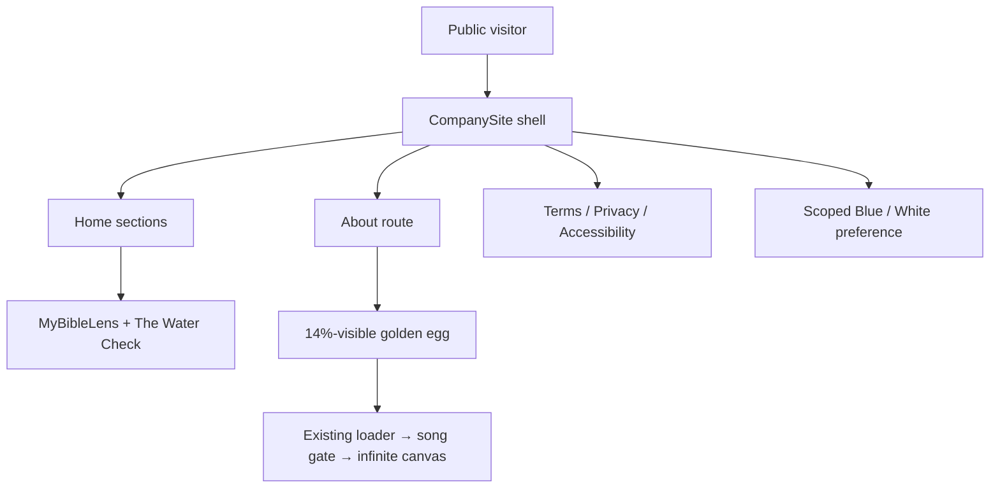

# Replace the Expected End storefront with the approved company site

## Goal Capsule

Replace the current freelancer-style storefront at `expectedend.co` with the approved Expected End LLC company experience: royal blue by default, optional white theme, compact project showcases for MyBibleLens and The Water Check, company mission and selected services, separate informational pages, and a discreet About-page golden egg that still opens the existing art world.

The public company site becomes the front door. The existing loader, song selection, frame, and infinite canvas remain a hidden secondary experience and are not redesigned in this project.

## Product Contract

### Summary

Expected End needs a company homepage that explains what it creates and why, without presenting the business as a freelance storefront. Visitors should immediately understand the mission, discover the two current projects, optionally explore selected services, and reach standard company information. The owner must retain the golden-egg route into the existing creative experience.

### Problem Frame

The current public menu emphasizes services, pricing, intake, mentorship, and a personal/professional-service identity. That no longer matches Expected End LLC's desired public identity as a mission-led software company and parent for multiple products. Its metadata is also intentionally marked `noindex`, so merely restyling the page would not create the intended public company presence.

The replacement must therefore address the visible experience, navigation model, accessibility, search metadata, and safe preservation of the hidden art world as one coordinated cutover.

### Actors

- **A1 — Public visitor:** Learns what Expected End does, discovers its projects, follows external project links, changes the visual theme, and reads company information.
- **A2 — Company owner/content approver:** Approves the company story, contact destination, and policy copy before production deployment; can also use the hidden golden egg to enter the art world.

### Requirements

- **R1 — Mission-first hero:** The homepage leads with `Purpose, built beautifully.` and the approved mission statement: `We create thoughtful software, productivity tools, digital experiences, and communities that bring people closer to God in exciting and easy ways!` The final mission clause is visually italicized.
- **R2 — Company visual system:** Use the Headquarters-inspired palette and typography: royal blue, heaven-like white, and gold; DM Sans for interface/body copy; Instrument Serif for expressive display copy; and Hammersmith One specifically for the MyBibleLens wordmark.
- **R3 — Theme choice:** Blue is the first-visit default. A visible White/Blue toggle in the floating navigation changes the public-site theme, persists the choice locally, and does not mutate the art world's existing `body[data-theme]` state.
- **R4 — Compact projects:** Show MyBibleLens and The Water Check as two compact, side-by-side logo treatments rather than large cards. Use the exact owner-selected images. Each project has a small category label, title, external visit action, and a `Bio` action whose popup is intentionally blank for now apart from its accessible project label and close control.
- **R5 — Correct external destinations:** MyBibleLens opens `https://mybiblelens.us/`; The Water Check opens `https://www.instagram.com/thewatercheck/`. External links use safe new-tab attributes and accessible names.
- **R6 — Mission and services:** Retain the mission content and present selected services under the heading `You dream it — we build it`. Remove the old `Our projects` introduction and all sales-storefront sections.
- **R7 — Real navigation:** The floating glass navigation contains Projects, Mission, Services, About, and the theme toggle. Homepage section links scroll to their targets; About and footer information open addressable routes that support refresh, browser Back/Forward, and keyboard use.
- **R8 — About and golden egg:** The About page carries the company backstory and is the only public page that displays the golden egg. The egg uses a 25×25 px visible image inside at least a 44×44 px interactive target, sits at the bottom right, rests at 14% opacity, and may become clearer on hover/focus.
- **R9 — Preserve the art world:** Activating the egg invokes the existing transition into the binary loader, song gate, frame, and infinite canvas. The art engine and its asset manifest remain functionally unchanged.
- **R10 — Company footer and information:** The footer provides Home, About, Terms of Service, Privacy Statement, Accessibility, and Contact; shows `© 2026 EXPECTED END LLC. All rights reserved.` and `Jesus loves you.`; and omits the removed `Expected End LLC / Software with purpose · Florida` block.
- **R11 — Public discoverability:** Remove the current `noindex` instruction, replace the personal freelancer metadata and ProfessionalService schema with accurate company metadata and Organization/project relationships, publish a sitemap, and preserve the existing robots protections for `/artworks/` and `/audio/`.
- **R12 — Accessibility and responsive quality:** Target WCAG 2.2 AA behavior: semantic landmarks, logical headings, visible focus, full keyboard operation, sufficient contrast, focus-safe dialogs, reduced-motion support, and layouts verified at mobile and desktop widths.
- **R13 — Remove the obsolete storefront:** Pricing, JARVIS, before/after, mentorship, service carousel, intake form, and old WaterCheck promotional modal are not carried into the replacement.
- **R14 — Truthful content gate:** The About story, company contact destination, Terms, Privacy, and Accessibility copy must be reviewed and approved by the owner before production deployment. No address, legal identifier, data practice, warranty, or policy promise may be invented.
- **R15 — Public/art-world isolation:** Before egg activation, the public company site must not mount the 3D canvas, fetch artwork/video textures, run the art world's anti-copy/scare triggers, or expose its personal-portfolio AI notice. Those existing behaviors may remain inside the activated art world only.
- **R16 — Route-aware identity:** Every addressable public page updates its document title, description, and canonical URL to match the current route; the homepage alone carries the company/project structured data unless another page gains unique verified schema.

### Key Flows

1. **Homepage discovery:** A1 opens `/`, sees the blue company hero, explores Projects, Mission, and Services, and reaches the company footer.
2. **Theme selection:** A1 switches to White; the company site updates immediately and remembers the preference on later visits without changing the art-world theme.
3. **Project discovery:** A1 selects a project logo/title or visit action and reaches the verified external destination. Selecting Bio opens an accessible, intentionally minimal dialog without fabricated biography text.
4. **Company story:** A1 opens `/about`, reads the approved backstory, and can return using the site navigation or browser controls.
5. **Hidden creative experience:** A2 activates the subtle About-page egg, sees the existing loader/song handoff, and enters the existing infinite canvas.
6. **Company information:** A1 follows footer links to `/terms`, `/privacy`, or `/accessibility`, refreshes the route successfully, and returns through the navigation or browser history.

### Acceptance Examples

- **First visit:** Given no saved site preference, when `/` loads, then the public company site renders in royal blue and the White/Blue control accurately communicates its state.
- **Saved preference:** Given White was selected, when the page is refreshed or an internal route is opened, then White remains selected.
- **Theme isolation:** Given a visitor changes the company theme, when the egg later opens the art world, then the art world's black/white/brown system still behaves independently.
- **Project layout:** At common laptop and 390 px mobile widths, both project identities remain compact and legible, stack only when needed, and never become the former oversized cards.
- **Mobile navigation:** At 780 px and below, hide the three in-page section shortcuts while keeping About and the complete White/Blue toggle visible in the floating bar; visitors still reach all homepage sections through normal page scrolling.
- **External links:** Selecting MyBibleLens or Visit app opens `mybiblelens.us`; selecting The Water Check or Visit Instagram opens the exact Instagram profile.
- **Blank biography:** Selecting Bio opens a project-labeled dialog with no invented body copy; Escape, backdrop interaction, and a visible close control dismiss it and restore focus.
- **Egg visibility:** The golden egg is absent from `/`, `/terms`, `/privacy`, and `/accessibility`; it is present only on `/about`, visually 25×25 px, and rests at 14% opacity.
- **Egg handoff:** Selecting the egg triggers the same loader and song-selection sequence that the old storefront used, without duplicating or rewriting the canvas engine.
- **Public isolation:** Before the egg is selected, no artwork/video texture request starts, copy/print/context-menu shortcuts retain normal browser behavior, and no personal anti-copy modal can appear. These art-world behaviors activate only after the handoff begins.
- **Direct routes:** Opening or refreshing `/about`, `/terms`, `/privacy`, or `/accessibility` on the Cloudflare Pages preview returns the React application and correct page content rather than a 404.
- **Indexability:** The built `index.html` has no `noindex`, contains accurate Expected End metadata and canonical data, and its structured data contains no unverified address, founder claim, or contact field.
- **Reduced motion:** With reduced motion enabled, decorative transitions and smooth scrolling are subdued while content and the egg handoff remain usable.

### Success Criteria

- The shipped public site visually matches the approved blue mockup and uses the exact two chosen logos.
- Every user-visible decision above is represented in automated or browser verification.
- The hidden art experience remains reachable and passes a regression walkthrough.
- The initial public page does not incur the hidden art world's 3D/texture load or global anti-copy behavior.
- Direct public routes work on the Cloudflare Pages preview.
- Search metadata describes Expected End as a company and permits indexing.
- Production deployment occurs only after owner approval of story, contact, and policy content.

### Scope Boundaries

#### In scope

- Public company shell, homepage, About, Terms, Privacy, and Accessibility routes.
- Blue/white public theme, compact project presentation, blank Bio dialog, footer, responsive behavior, and accessibility.
- Existing golden-egg handoff into the existing art world.
- Lifecycle isolation so the heavy/hostile-to-browsing art-world behaviors begin only after egg activation.
- Metadata, robots, sitemap, manifest, structured data, README, automated tests, and preview QA.
- Deletion of the obsolete storefront code after the replacement is connected and verified.

#### Out of scope

- Headquarters dashboard work, Supabase, Plaid, banking, accounting, or email integrations.
- CMS, admin editing, analytics, newsletter, intake/contact forms, or a services checkout flow.
- Writing substantive project bios; the owner intentionally deferred them.
- Refactoring the loader, song dashboard, frame, infinite canvas, or artwork collection.
- Legal advice or a claim that policy drafts guarantee compliance.
- New project identities or a production deployment before the owner content gate is satisfied.

### Dependencies

- Approved visual reference: `.context/compound-engineering/ce-brainstorm-visual/expectedend-homepage/screens/001-public-headquarters.html`.
- Approved images: `.context/compound-engineering/ce-brainstorm-visual/expectedend-homepage/screens/assets/mybiblelens-rounded.png`, `thewatercheck-logo.png`, and `golden-egg.png`.
- Existing public-to-art transition in `src/app/index.tsx`.
- Existing hidden experience in `src/loader/`, `src/song-dashboard/`, `src/frame/`, and `src/infinite-canvas/`.
- Owner-supplied/approved About story, contact destination, and policy language before deployment.

---

## Planning Contract

### Product Contract Preservation

This plan is bootstrapped from the approved local mockup and the owner's settled decisions. Implementation may refine responsive spacing, semantic markup, and internal organization, but must not silently change the approved message, destinations, palette, project prominence, footer, or egg behavior. Any product-level change returns to the owner for approval.

### Key Technical Decisions

| Decision | Choice | Why |
| --- | --- | --- |
| KTD1 — Public-site boundary | Introduce `src/company-site/`; remove `src/menu/` only after cutover | Separates the durable company experience from obsolete storefront code and limits changes to the art system. |
| KTD2 — Routing | Small History API route table for the five static routes; no router dependency | The route set is fixed and shallow. Cloudflare Pages already supports SPA fallback when no top-level `404.html` exists. |
| KTD3 — Homepage sections | Hash-based section targets on `/`; About/legal items use paths | Preserves a simple one-page company story while providing linkable company information. |
| KTD4 — Theme scope | `data-site-theme` on the company root plus `expectedend-site-theme` local storage | Prevents collision with the art world's existing `body[data-theme]` system. |
| KTD5 — Art lifecycle | Mount the frame/canvas and enable scare/AI-notice behavior only after egg activation | Prevents the 56 MB artwork collection and personal anti-copy behavior from affecting ordinary company visitors while preserving the hidden experience after entry. |
| KTD6 — Font delivery | Update the existing Google Fonts request to DM Sans, Instrument Serif, and Hammersmith One | Preserves the approved typography with the repository's existing delivery pattern; the Privacy draft must disclose that third-party request. |
| KTD7 — Content model | Typed local data/constants, not a CMS | Content is small, owner-controlled, and has no current editing workflow. |
| KTD8 — Image delivery | Promote approved images into `public/brand/` with stable names | Keeps exact owner-approved assets available to Vite without coupling production to `.context/`. |
| KTD9 — Dialog behavior | Native semantic dialog behavior or an equivalent tested focus-managed component | Gives the blank Bio interaction keyboard, Escape, focus restoration, and screen-reader behavior. |
| KTD10 — Test foundation | Add Vitest, React Testing Library, user-event, and jsdom | The project has no component test runner; routing, theme, modal, and handoff behavior are regression-prone enough to warrant one. |
| KTD11 — Search identity | Accurate Organization JSON-LD and project relationships; remove ProfessionalService | Matches the new company identity without inventing unverified attributes. |
| KTD12 — Release method | Local/browser QA → Cloudflare preview → owner content approval → production deploy | Keeps legal/company statements and route behavior verifiable before replacing the live site. |

### High-Level Design



### System-Wide Impact

- **Application entry:** `src/app/index.tsx` keeps ownership of the one-way company → loader → song gate → art-world state machine; only the public child changes from `ServiceMenu` to `CompanySite`.
- **Browser-global state:** Company routing, route metadata, and theme persistence add History API, `popstate`, document-head, and local-storage effects. Each effect must clean up listeners and must not overwrite the art world's `body[data-theme]` value.
- **Heavy media lifecycle:** The canvas, artwork textures, frame, anti-copy listeners, and AI notice become conditional on art activation. Reload remains the existing way to return from the art world to the company site; adding an in-app exit is outside scope.
- **Static hosting:** No server, database, authentication, or data migration is introduced. Cloudflare's SPA fallback is the only runtime dependency for direct public routes and is verified on a preview.
- **Public identity:** Metadata, robots, sitemap, manifest, policy text, and visible company content change together so crawlers and visitors receive one consistent identity.

### Risks and Controls

- **Theme collision:** The current art experience already uses a global `data-theme`. Control it by keeping the company preference on a separate root attribute and testing the handoff after both theme choices.
- **Broken hidden experience:** Replacing `ServiceMenu` can accidentally sever the `onEggOpen` callback or timing. Control it with a single compatibility callback in the company shell and an integration test around the transition trigger.
- **Public performance and behavior leakage:** The current app mounts the canvas and global anti-copy triggers under the landing page. Control it by gating their render/effects on art activation, verifying no `/artworks/` or artwork-video requests before the egg, and regression-testing the loader handoff.
- **False legal promises:** Generic policy boilerplate can misrepresent actual data practices. Control it with truthful drafts, explicit placeholders during development, and a hard owner-approval gate before production. The FTC advises businesses to honor the privacy promises they make.
- **Indexing regression:** Removing `noindex` without replacing stale personal metadata would expose the wrong identity. Treat robots, canonical, social metadata, sitemap, and structured data as one release unit.
- **Deep-link 404s:** Client routes may work locally but fail after deployment. Verify direct navigation and refresh on a Cloudflare preview; preserve Pages' SPA fallback conditions.
- **Tiny hidden control:** The egg must look tiny without becoming inaccessible. Separate the 25 px visual from a 44 px focusable hit area and provide a visible focus state.
- **Asset quality/weight:** The supplied project images are large. Preserve the exact artwork but generate fit-for-web variants as a mechanical optimization, verifying sharpness and transparency visually.

### Sequence and Release Gates

1. Establish the new component/test boundary and theme isolation.
2. Build the homepage from the approved visual and exact assets.
3. Add route-backed informational pages and reconnect the golden egg.
4. Replace public metadata and remove the obsolete storefront.
5. Run automated, browser, metadata, and Cloudflare preview verification.
6. Obtain owner approval for About, contact, Terms, Privacy, and Accessibility content.
7. Only then deploy the replacement to production.

### External Guidance

- Follow [WCAG 2.2 guidance](https://www.w3.org/WAI/standards-guidelines/wcag/) for the accessibility target and interaction checks.
- Google documents that [`noindex` prevents a page from appearing in search results](https://developers.google.com/search/docs/crawling-indexing/robots-meta-tag), so removal is intentional for this public launch.
- Shape structured data using Google's [Organization structured-data guidance](https://developers.google.com/search/docs/appearance/structured-data/organization) and [general policies](https://developers.google.com/search/docs/appearance/structured-data/sd-policies); include only visible and accurate facts.
- Verify direct routes against Cloudflare Pages' documented [SPA serving behavior](https://developers.cloudflare.com/pages/configuration/serving-pages/).
- Review privacy language against the FTC's guidance on [truthful consumer privacy promises](https://www.ftc.gov/business-guidance/privacy-security/consumer-privacy).

---

## Implementation Units

### U1 — Company shell, routing, theme isolation, and test harness

**Goal:** Create the production boundary for the new site without changing the hidden art engine.

**Requirements covered:** R2, R3, R7, R9, R12, R15, R16.

**Files:**

- Add `src/company-site/index.tsx`.
- Add `src/company-site/style.module.css`.
- Add `src/company-site/routes.ts`.
- Add `src/company-site/theme.ts`.
- Add `src/company-site/routes.test.ts` and `src/company-site/theme.test.ts`.
- Update `src/app/index.tsx` and, only where required for clean transitions, `src/app/style.module.css`.
- Update `src/scare/index.tsx` so its global listeners can be explicitly enabled only inside the art-world lifecycle.
- Update `package.json`, `package-lock.json`, and `vite.config.ts` for the test environment.

**Approach:**

1. Define the supported pathname union: `/`, `/about`, `/terms`, `/privacy`, and `/accessibility`, with an unknown-path fallback to the homepage or a small in-app not-found state chosen consistently.
2. Implement History API navigation with click interception only for same-origin internal links, `popstate` handling, scroll-to-top for pages, and hash scrolling for homepage sections. A section link used from another route first renders `/` and then scrolls after the target exists. Preserve normal modified-click/new-tab behavior.
3. Create a `CompanySite` component accepting `onOpenArtWorld`, keeping the existing callback boundary explicit.
4. Store `blue | white` under `expectedend-site-theme`. Default to blue when absent/invalid; tolerate unavailable local storage; apply `data-site-theme` only to the company root.
5. Add the minimum test runner and DOM setup needed for deterministic component tests.
6. Switch `src/app/index.tsx` from `ServiceMenu` to `CompanySite` while retaining the covered/uncovered transition contract. Mount `Frame`, `InfiniteCanvas`, art-only notices, and scare listeners only once egg activation begins; the loader provides cover while the lazy canvas initializes.
7. Centralize route metadata in the route table and update title, description, and canonical URL on navigation and `popstate`.

**Test scenarios:**

- Direct route resolution and unknown route behavior.
- Internal navigation pushes history; `popstate` rerenders the correct page.
- Homepage hash targets scroll without corrupting route state.
- A homepage section link selected from About or an information page renders Home, finds the target, and scrolls only after that target exists.
- Blue defaults; White persists; invalid storage values recover to blue.
- Theme attributes never write to `body[data-theme]`.
- `onOpenArtWorld` remains callable exactly once from the company boundary.
- Before handoff, art components are absent and scare listeners are disabled; after handoff begins, they activate without changing the existing song/canvas flow.
- Route metadata updates on direct load, internal navigation, and browser Back/Forward.

**Verification:** `npm test -- --run`, `npm run check:types`, and a manual browser Back/Forward check before building visual pages.

**Dependencies:** None.

### U2 — Approved homepage, assets, project interactions, and footer

**Goal:** Turn the approved blue mockup into the responsive production homepage.

**Requirements covered:** R1–R7, R10, R12, R13.

**Files:**

- Add `src/company-site/home.tsx`.
- Add `src/company-site/navigation.tsx`.
- Add `src/company-site/footer.tsx`.
- Add `src/company-site/bio-dialog.tsx`.
- Add `src/company-site/content.ts`.
- Add `src/company-site/index.test.tsx`.
- Add `public/brand/mybiblelens.png` and `public/brand/thewatercheck.png` from the approved source assets.
- Extend `src/company-site/style.module.css`.

**Approach:**

1. Translate the approved mockup into semantic header/main/section/footer structure instead of copying it as a monolithic HTML file.
2. Implement the floating glass nav with section links, About, and only the White/Blue toggle in its utility area; do not restore the removed `E / Expected End / Software company` block.
3. At 780 px and below, hide Projects/Mission/Services in the floating bar, keep About and both theme choices visible, and preserve access to the omitted sections through the document's normal vertical flow.
4. Render the hero headline and mission statement exactly as approved, including expressive italic spans.
5. Render two compact project identities side by side at laptop widths and responsively at narrow widths. Use real anchor elements for the logo/title destinations and keep Hammersmith One limited to MyBibleLens branding.
6. Implement a reusable Bio dialog with the project name as its accessible label, no invented biography body copy, and a visible close control. Manage initial focus, Escape/backdrop close, background inertness where supported, and focus restoration.
7. Bring Selected services upward in the laptop composition and use `You dream it — we build it` as its visible heading.
8. Add the approved footer links/copyright/blessing. Keep Contact visually present but point it only to an owner-verified destination; during development, represent the unresolved destination in typed content and fail the release content check rather than using `#`.
9. Optimize copies of the supplied raster files for display size while retaining the owner-selected imagery and sufficient high-density resolution.

**Test scenarios:**

- Approved headline and exact mission text render once with correct semantic hierarchy.
- Both project destinations and safe external-link attributes are exact.
- Project presentation remains compact; no legacy pricing/intake/service copy is rendered.
- Bio opens from either project, exposes a labeled dialog, closes by button/Escape/backdrop, and restores focus.
- Every footer item points to a real internal route or verified contact destination; no inert `#` links.
- Toggle names and pressed/selected state remain accurate in both themes.

**Verification:** Automated DOM tests plus browser inspection at 1440×900, 1024×768, 768×1024, and 390×844; check overflow, type loading, logo sharpness, focus indicators, and contrast in both themes.

**Dependencies:** U1; owner confirmation of Contact destination before the production gate.

### U3 — About story and the hidden golden-egg handoff

**Goal:** Give the company backstory its own page and preserve the beloved art-world entrance as a subtle Easter egg.

**Requirements covered:** R7–R9, R12, R14, R15.

**Files:**

- Add `src/company-site/about.tsx`.
- Add `src/company-site/golden-egg-button.tsx`.
- Add `src/company-site/about.test.tsx`.
- Add `public/brand/golden-egg.png` from the approved source asset.
- Update `src/company-site/content.ts` and `src/company-site/style.module.css`.
- Update `src/app/index.tsx` only if the compatibility callback requires a narrow adjustment.

**Approach:**

1. Build the About page with a content slot for the owner-approved Expected End backstory; do not move the old founder sales copy into it.
2. Add a fixed bottom-right egg control only inside the About route. Keep the image at 25×25 px and 14% opacity at rest while the focusable control is at least 44×44 px.
3. Provide an accessible name that does not visually reveal the Easter egg. Use a clear keyboard focus treatment and raise opacity on hover/focus without making the resting control prominent.
4. Wire activation to `onOpenArtWorld`, preserving the existing loader delay, song gate, `ee-entrance` dispatch, and infinite-canvas ownership in `src/app/index.tsx`.
5. Honor reduced motion in the company-site fade/transition while keeping the loader handoff operational.

**Test scenarios:**

- About route renders the approved story and the egg; all other public routes omit the egg.
- Computed/style contract represents 25 px visual, 44 px minimum target, and 0.14 resting opacity.
- Pointer, Enter, and Space activation trigger one handoff.
- Art-world callback is not triggered by navigating to About or by theme changes.
- No artwork/video texture request or art-world scare behavior occurs before activation; both are available after activation.
- Back/Forward works before entering the art world.

**Verification:** Browser walkthrough in Blue and White themes, pointer and keyboard activation, reduced-motion mode, then a full loader → song selection → infinite canvas regression.

**Dependencies:** U1–U2; owner-approved About copy before production.

### U4 — Terms, Privacy, Accessibility, and content approval gate

**Goal:** Provide standard, readable company information without publishing invented or misleading legal claims.

**Requirements covered:** R7, R10, R12, R14.

**Files:**

- Add `src/company-site/info-page.tsx`.
- Add `src/company-site/legal-content.ts`.
- Add `src/company-site/info-page.test.tsx`.
- Add `src/company-site/public-content.test.ts`.
- Update `package.json` with a `check:public-content` script.
- Extend `src/company-site/style.module.css`.

**Approach:**

1. Use one semantic informational-page layout for Terms, Privacy, and Accessibility, with route-specific headings, effective dates, readable measure, in-page heading structure, and shared navigation/footer.
2. Draft only statements supported by the current public site. Explicitly account for external project links, local theme storage, Google Fonts delivery, and the absence of a public account/payment/contact-form flow.
3. Mark fields requiring owner verification in structured source data, not visible fake copy: contact destination, effective date, governing details where appropriate, and any future analytics or collection practices.
4. Add a deterministic Vitest content check that fails if required approval fields remain unresolved. Expose a focused `check:public-content` package script that runs that test, avoiding a second TypeScript execution tool.
5. Add a plain-language Accessibility statement with a verified contact path for reporting barriers. Treat the page as a statement of effort and feedback process, not a certification guarantee.
6. Obtain owner review and, if desired, professional legal review before clearing the production gate.

**Test scenarios:**

- Each footer information link resolves to the right heading and supports direct refresh.
- Legal pages contain no lorem ipsum, dead links, or unfilled tokens in the rendered UI.
- Public-content check fails for missing approval fields and passes only when every required field is explicitly resolved.
- Theme, navigation, focus, and mobile readability are consistent with the rest of the site.

**Verification:** Automated route/content tests and browser direct-load/reload checks. Record unresolved approval fields for the preview; `npm run check:public-content` becomes mandatory only after owner sign-off and before production.

**Dependencies:** U1–U2; owner-approved policy/contact content before production.

### U5 — Search identity, cleanup, full QA, and preview release

**Goal:** Complete the public identity cutover, remove obsolete code, and prove the replacement is safe before production.

**Requirements covered:** R9–R16.

**Files:**

- Update `index.html`.
- Update `public/robots.txt`.
- Add `public/sitemap.xml`.
- Update `public/site.webmanifest`.
- Update `public/ai.txt` without inventing contact information.
- Update `README.md`.
- Remove `src/menu/index.tsx`, `src/menu/carousel.tsx`, `src/menu/intake.tsx`, `src/menu/services.ts`, and `src/menu/style.module.css` after usage checks pass.
- Review `public/watercheck-demo.mp4` and `public/watercheck-poster.jpg`; retain them unless the owner separately approves asset cleanup or repository search proves they are obsolete and their removal is non-destructive to desired history.

**Approach:**

1. Replace the old personal/freelancer title, description, social metadata, copyright, and JSON-LD with accurate Expected End company information. Reuse the route metadata contract so internal navigation and direct routes expose the correct title, description, and canonical URL.
2. Remove `noindex`; add a canonical URL and Organization structured data whose project relationships point to the two verified destinations. Include only truthful visible fields. Do not publish an address, EIN, legal filing detail, or unverified founder/contact value.
3. Add a sitemap for the five public routes. Update robots comments and sitemap discovery while preserving `/artworks/` and `/audio/` protections and the current bulk-bot intent.
4. Give the manifest an accurate company-site name/short name while retaining the golden-egg favicon family unless the owner requests a new identity asset.
5. Update README architecture and commands so future work understands that the company site is public and the art world is an Easter egg.
6. Prove the old menu has no imports, remove it, and run a string search for stale JARVIS, pricing, mentorship, intake, Scriptorium, ProfessionalService, and `noindex` output.
7. Run tests, static checks, and the build locally, then deploy to a Cloudflare Pages preview only. Test direct routes and the egg flow on that preview; the release-only content check may remain red solely for explicitly marked approval fields.
8. Present the preview and final content checklist to the owner. After approval, resolve every marked field, run `npm run check:public-content` and the complete verification contract, and prepare the separately authorized production deployment.

**Test scenarios:**

- Built HTML has the expected title, description, canonical, indexable robots directive, social metadata, and parseable JSON-LD.
- Sitemap contains every public route and robots references it.
- Robots continues protecting art/audio paths.
- No production import references `src/menu/`; no obsolete sales UI appears.
- Preview deep links and refreshes work.
- The preview's full public-to-art transition works on desktop and mobile.

**Verification:** Full command suite and browser matrix below, plus Cloudflare preview QA. Do not run the production deploy command until the owner has approved content and the preview.

**Dependencies:** U1–U4. Owner content approvals gate the final production-ready handoff, not creation of the preview.

---

## Verification Contract

### Automated checks

Run from the repository root:

```sh
npm test -- --run
npm run check
npm run build
npm run check:public-content
```

If `npm run check` already composes type and Biome checks, avoid duplicating them in CI; otherwise explicitly run `npm run check:types` and `npm run check:biome`.

### Browser checks

- Desktop: 1440×900 and 1024×768 in Blue and White.
- Tablet/mobile: 768×1024 and 390×844 in Blue and White.
- Keyboard-only: nav, theme toggle, project links, both Bio dialogs, all information routes, and the egg.
- Browser history: section links, About/legal navigation, Back/Forward, and direct-route refresh.
- Motion: normal and `prefers-reduced-motion: reduce`.
- Content: exact approved copy, exact external destinations, exact logos, correct footer, and absence of old storefront language.
- Regression: About → egg → loader → song gate → art canvas, including art-world color switching.
- Isolation: before egg activation, confirm normal copy/print/context-menu behavior and no network requests for `/artworks/` or artwork videos.

### Metadata and deployment checks

- Inspect `dist/index.html`, `dist/robots.txt`, `dist/sitemap.xml`, `dist/site.webmanifest`, and JSON-LD output.
- Confirm no `noindex`, ProfessionalService, stale personal sales description, unfilled token, or fake contact value ships.
- On the Cloudflare preview, open every public path directly and refresh it.
- Check console/network errors, fonts, image dimensions/weight, and external links.
- Do not deploy production until `check:public-content` passes and the owner approves the preview.

## Definition of Done

- All R1–R16 requirements are implemented and traceable to tests or browser checks.
- The approved homepage replaces the old storefront locally and on a reviewed Cloudflare preview.
- About, Terms, Privacy, and Accessibility are real addressable pages.
- The company theme is isolated from the art theme and persists correctly.
- The golden egg appears only on About at the exact approved scale/opacity and still opens the existing art world.
- Public metadata is accurate and indexable; art/audio crawl protections remain.
- Obsolete storefront source is removed only after the new entry point and regression checks pass.
- Automated checks, build, desktop/mobile QA, accessibility walkthrough, and preview deep-link checks pass.
- Owner approval is recorded for the About story, contact destination, policy copy, and preview.
- Production deployment happens only as a separately authorized final step.
