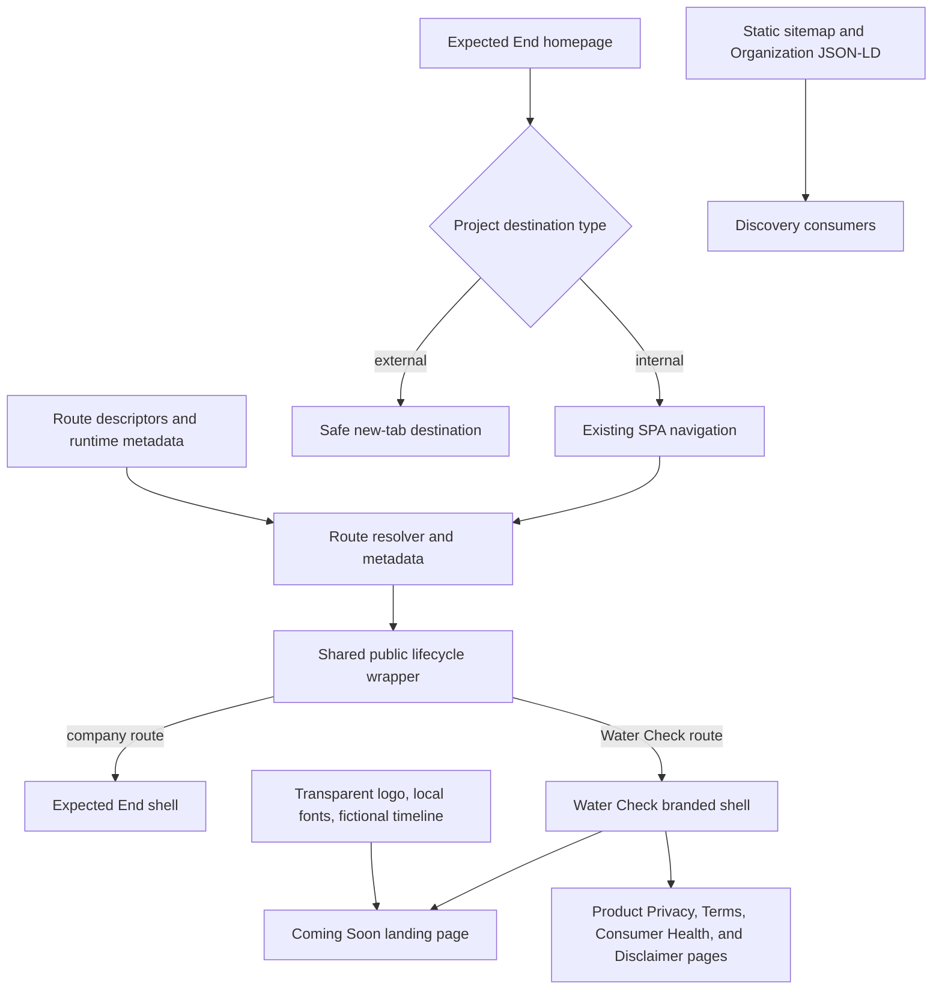

# Water Check Coming Soon Experience - Plan

## Goal Capsule

- **Objective:** Launch an original Water Check Coming Soon microsite inside `expectedend.co`, connect the existing homepage project logo to it, and provide truthful product-specific legal and health-safety surfaces.
- **Authority:** The Product Contract in this plan governs behavior. The Planning Contract governs implementation choices. Current repository patterns and owner-approved assets govern visual integration.
- **Execution profile:** Extend the existing React/Vite single-page app without adding a router, backend, account system, waitlist, analytics, or health-data collection.
- **Stop conditions:** Pause if implementation would require inventing live app capabilities, data practices, testimonials, medical claims, third-party providers, or legal promises that the owner has not approved.
- **Tail ownership:** The implementation must pass repository checks, direct-route browser verification, mobile and reduced-motion review, and the public-content release gate before it is complete.

---

## Product Contract

### Summary

Create a Water Check-branded Coming Soon experience at `/thewatercheck` that turns interest from the Expected End homepage into a clear product story. The page explains the planned drink-logging and bloating-pattern loop, marks both app stores as Coming Soon, and gives visitors product-specific privacy, terms, consumer-health, and health/AI information without claiming that the unfinished app already collects data.

### Problem Frame

The Expected End homepage currently presents The Water Check as an Instagram community. Its large logo and project action leave the site for Instagram, so visitors cannot learn about the planned app or review product-specific legal information on `expectedend.co`.

The product concept is still being developed. The intended app may accept a product scan or natural-language drink log, track hydration and nutritional information, ask about bloating, and use AI to explain possible patterns. A Coming Soon page can market this direction, but it must not present unfinished features as available or imply that correlation establishes medical causation.

Consumer-health and demographic information create elevated privacy and advertising risk. The first website milestone therefore asks visitors for no waitlist, symptom, scan, demographic, or health data. It establishes honest public language and separate legal routes while deferring the final app privacy contract until the app's vendors, storage, retention, analytics, model-training, and deletion architecture are known.

### Actors

- A1. **Prospective user:** An adult visitor learning what The Water Check plans to offer, its current availability, and how to follow launch updates without submitting personal data.
- A2. **Expected End owner:** The release approver responsible for confirming product claims, effective dates, legal language, and owner-provided assets.

### Requirements

#### Navigation and brand experience

- R1. Selecting the large Water Check artwork or its primary project action on the Expected End homepage opens `/thewatercheck` in the same tab through the site's existing internal-navigation behavior.
- R2. The Water Check experience uses its own branded header, footer, visual language, and product navigation while remaining on `expectedend.co` and retaining a visible connection to Expected End. The header links the product mark to `/thewatercheck` and includes an Expected End return; the footer contains the four product-legal routes, Instagram, and Expected End.
- R3. Instagram remains available only as a secondary Water Check social destination and optional launch-updates path; it is not the primary homepage destination and is never embedded.
- R4. Direct loads, trailing-slash variants, browser back/forward navigation, and unknown-route fallback continue to work within the existing Vite single-page app.

#### Coming Soon product story

- R5. The hero uses the owner-directed, fixed creative hook “You’re not fat, just bloated.” and the supporting line “Snap. Track. Debloat.” The same hero viewport immediately reframes the hook as exploring possible bloating patterns rather than determining body composition or a medical cause. The categorical sentence is not repeated in metadata, alt text, legal headings, or standalone social copy.
- R6. The page explains the planned loop as logging a drink, recording a bloating check-in, and noticing possible personal patterns over time.
- R7. Feature presentation may describe planned product scans, natural-language drink logging, hydration and nutrient tracking, bloat check-ins, and educational AI explanations only when the page identifies the experience as Coming Soon.
- R8. App Store and Google Play controls are visibly labeled Coming Soon, do not claim a live listing, and give users a non-modal inline status response instead of navigating to an invented destination. The response uses polite live-region semantics, moves no focus, has no toggle state, and repeats predictably on later activation.
- R9. The page contains no invented ratings, testimonials, user counts, medical endorsements, certifications, or performance claims.

#### Assets and presentation

- R10. The owner-provided liquid-glass C remains preserved as a source asset and produces a transparent, optimized web derivative with clean edges at mobile and high-density desktop sizes.
- R11. The page uses a purpose-made fictional product timeline or mockup to explain the intended experience. Existing demo video and poster files containing real social identities are not published on the landing page unless every identity is removed or separately cleared for this use.
- R12. The page is responsive, keyboard accessible, readable with motion reduced, free of horizontal overflow, and robust against the existing mobile-Safari glass/compositing failure mode.

#### Health, privacy, and legal truthfulness

- R13. The product is positioned for adults age 18 and older.
- R14. AI and nutritional output is described as educational, approximate, and potentially incomplete; it does not diagnose, treat, prevent, or identify the definitive cause of a health condition.
- R15. A concise limitation statement appears beside the AI/pattern explanation and is reinforced in the FAQ and dedicated Health & AI Disclaimer.
- R16. The Coming Soon website asks visitors to submit no health information, product scans, AI conversations, age, gender, ethnicity, racial identity, or waitlist email. Before privacy approval, every unavoidable host or security datum must be inventoried with its purpose, system owner, authorized access, protection, retention/deletion rule, recipient or subprocessor, and whether nonessential processing is disabled.
- R17. Product-specific Privacy (`/thewatercheck/privacy`), Terms (`/thewatercheck/terms`), Health & AI Disclaimer (`/thewatercheck/health-and-ai-disclaimer`), and Consumer Health Data (`/thewatercheck/consumer-health-data`) routes remain separate from Expected End's company-wide legal pages.
- R18. Water Check legal content describes current website behavior and clearly distinguishes future app intentions from implemented data practices.
- R19. Future collection of demographic information remains outside this website milestone; any later app collection must be optional, purpose-specific, support “prefer not to say,” and undergo privacy and equity review before launch.
- R20. Legal and health-sensitive copy remains blocked from public release until A2 confirms the language, effective date, entity naming, contact path, and reviewed-content digest. The approval record identifies the approver and approval date, and any governed-content change invalidates it.

#### Discovery and consistency

- R21. Runtime route metadata plus the static sitemap and Organization structured data identify `/thewatercheck` as the primary product destination. The current client-rendered architecture does not promise route-specific metadata to crawlers that do not execute JavaScript; that limitation is recorded rather than disguised as a passing release check.
- R22. Existing Expected End routes, company legal statements, the Water Check founder Bio story, and the blue-only company theme remain unchanged unless a change is required by R1-R24. The one planned company-policy change is removal of the obsolete Google Fonts disclosure after equivalent fonts are self-hosted, and it requires renewed owner approval.
- R23. Initial page load uses only same-origin scripts, fonts, images, video, and poster assets; social destinations load no third-party SDK, widget, tracker, or embed before an intentional visitor click.
- R24. Every health, AI, body, bloating, and causal-pattern claim across visible copy, metadata, media text, and legal pages is included in the owner approval review required by R20.

### Key Flows

- F1. **Homepage discovery**
  - **Trigger:** A1 selects the Water Check artwork or primary action on the Expected End homepage.
  - **Actors:** A1
  - **Steps:** The SPA recognizes an internal destination, updates history, resolves the Water Check route family, and renders the branded product experience.
  - **Outcome:** A1 remains on `expectedend.co/thewatercheck` and can understand the Coming Soon product.
  - **Covered by:** R1-R4, R21
- F2. **Coming Soon conversion**
  - **Trigger:** A1 selects an App Store or Google Play control.
  - **Actors:** A1
  - **Steps:** The page presents an accessible Coming Soon status without opening another site or claiming availability.
  - **Outcome:** A1 receives an honest availability response, can continue exploring, and may intentionally follow the secondary Instagram launch-updates link.
  - **Covered by:** R7-R9
- F3. **Trust and legal review**
  - **Trigger:** A1 follows a Water Check legal or safety link.
  - **Actors:** A1, A2
  - **Steps:** The SPA opens the matching product-specific route, presents the current website scope, and provides a path back to the Water Check page.
  - **Outcome:** A1 can distinguish current website behavior from future app intentions.
  - **Covered by:** R13-R20

### Acceptance Examples

- AE1. **Internal project navigation**
  - **Covers:** F1, R1-R4
  - **Given:** A1 is on the Expected End homepage.
  - **When:** A1 selects the Water Check logo or primary project action.
  - **Then:** The same tab displays `/thewatercheck`, and browser back returns to the homepage.
- AE2. **Direct product route**
  - **Covers:** R2, R4-R7, R21
  - **Given:** A1 enters `/thewatercheck/` directly.
  - **When:** The SPA loads.
  - **Then:** The branded Coming Soon experience renders with Water Check metadata and no company-route fallback.
- AE3. **Store availability**
  - **Covers:** F2, R8-R9
  - **Given:** No App Store or Google Play listing exists.
  - **When:** A1 activates either store control by pointer or keyboard.
  - **Then:** A polite inline status communicates Coming Soon without moving focus, changing toggle state, navigating, or opening a new tab.
- AE4. **Health limitation near the claim**
  - **Covers:** R5, R14-R15
  - **Given:** A1 reads how AI may connect a drink with bloating.
  - **When:** The feature claim is visible.
  - **Then:** A nearby statement says the insight is educational, may be incomplete, and does not establish diagnosis or causation.
- AE5. **Product legal boundary**
  - **Covers:** F3, R16-R20
  - **Given:** A1 opens the Water Check Privacy page.
  - **When:** The legal content renders.
  - **Then:** It says the current page asks for no visitor-submitted health or demographic data, discloses verified operational request data, and does not claim that unfinished app data flows exist.
- AE6. **Accessible responsive presentation**
  - **Covers:** R10-R12
  - **Given:** A1 uses a 390-pixel viewport, keyboard navigation, or reduced-motion settings.
  - **When:** A1 explores the page and its media.
  - **Then:** Content remains readable, controls remain operable and visible, glass effects stay contained, and motion-heavy presentation is suppressed.

### Scope Boundaries

#### Included

- A static Coming Soon microsite and product-specific legal/safety routes within the existing Expected End SPA.
- Transparent logo preparation from the approved source without destructively replacing it.
- A fictional, identity-free journal timeline or interface mockup that demonstrates drink logging, a later bloat check-in, and a qualified possible-pattern observation.
- Homepage navigation, metadata, structured data, sitemap, responsive styling, accessibility, automated tests, and browser verification.

#### Deferred to Follow-Up Work

- A waitlist, newsletter, or other visitor-data capture.
- Final app Privacy, Terms, consent, deletion, export, retention, breach-response, vendor, analytics, advertising, and AI model-training contracts.
- App accounts, authentication, databases, product scanning, AI integration, health-data storage, demographic profiling, and app-store submission.
- Medical review, clinical validation, substantiated accuracy claims, testimonials, ratings, and user-count proof.

#### Outside this product milestone

- Copying Cal AI or Flo code, copy, assets, testimonials, legal language, or protected branding.
- Reworking the Expected End company theme, founder story, art-world experience, or unrelated company pages.

---

## Planning Contract

### Key Technical Decisions

- KTD1. **Keep one public-site composition root and the existing route mechanism.** The current `src/company-site/index.tsx` remains the pragmatic owner of public route state, document-head effects, navigation interception, and shell selection. It may import Water Check features, but Water Check receives navigation contracts through props and must not install its own history or metadata effects. A neutral route taxonomy is preferred when it can be introduced without broad unrelated churn.
- KTD2. **Separate the shared public wrapper from visual shells.** Both route families retain neutral lifecycle responsibilities such as minimum height, horizontal containment, z-index, and the existing leaving transition. Company navigation, footer, colors, and typography remain in the company shell; `/thewatercheck` and its nested legal routes receive a product-branded shell.
- KTD3. **Represent destination type explicitly.** Give each project a discriminated internal or external destination and propagate the public navigation callback through `HomePage`. Destination type governs click interception, modified-click preservation, target, relationship attributes, icon treatment, and label instead of project-name exceptions.
- KTD4. **Isolate the microsite styles.** Add a Water Check feature directory and CSS module rather than extending the already large company stylesheet. Reuse visual tokens and accessibility conventions without coupling the page to company layout selectors.
- KTD5. **Treat Coming Soon as a real, non-collecting interaction state.** Store controls remain keyboard-operable non-form buttons. Activation updates a nearby polite status region with no focus movement or toggle semantics and causes no navigation, request, submission, analytics event, or persistent storage mutation.
- KTD6. **Separate current website truth from future app intent.** Product legal routes use dedicated content and effective dates plus a content-bound approval record containing the approver, approval date, and governed-content digest. They do not claim that a specific consumer-health law applies or promise unsupported future vendors, rights workflows, retention periods, or security controls. Any necessary company-policy edit remains separately owner-approved.
- KTD7. **Preserve and derive brand media.** Use the owner-provided `03-Liquid-Glass-C.png` (1254 by 1254 pixels) as the handoff source, keep it outside runtime references, create a transparent optimized derivative under `public/brand/`, and retain the existing 640-pixel asset until references can migrate safely. Pause U2 if that exact input cannot be verified.
- KTD8. **Keep discovery authority split by existing ownership.** Route descriptors own runtime title, description, canonical, and Open Graph mutation. `index.html` owns the site-wide Organization JSON-LD relationship to Water Check, and `public/sitemap.xml` independently lists every indexable product route. A no-JavaScript fetch is recorded as a known client-rendering limitation; route-specific crawler metadata remains deferred because the site has no SSR or prerender pipeline.
- KTD9. **Use Cal AI for conversion structure and Flo for trust-placement patterns only.** Original Water Check copy, visuals, interaction, and legal language must satisfy R9 and the current-site truth boundary in R16-R20.

### High-Level Technical Design

### Implementation Constraints

- Preserve the existing untracked `.context/` directory and recheck repository state before implementation because another Codex session may have changed branches or files.
- Follow the current Biome, TypeScript, React namespace-import, CSS Module, accessibility, and reduced-motion conventions.
- Keep direct-route support compatible with Cloudflare Pages and the shared Vite SPA entry.
- Replace the global Google Fonts requests with licensed, repository-local WOFF2 assets for the existing font families so Water Check direct loads satisfy the same-origin contract without changing the established company typography.
- Use inline SVG or existing icon patterns rather than Unicode symbols for interface controls.
- Keep health and privacy claims consistent across hero copy, feature sections, FAQ, legal routes, metadata, and structured data.

### System-Wide Impact

- **Application lifecycle:** `src/app/index.tsx` remains the sole owner of the company-to-art-world transition. Water Check changes only the public-site child and cannot create a new application-level state.
- **Navigation and document state:** The public composition root remains the only owner of History API listeners, internal navigation interception, route metadata, and shell selection. Product components receive callbacks and route content; they do not create global listeners or head effects.
- **Styling boundary:** A neutral shared wrapper preserves lifecycle, containment, and stacking behavior. Company and Water Check visual shells own their separate navigation, footer, color, and typography rules.
- **Network and privacy boundary:** Landing assets and the existing site fonts are local. External social destinations load only after an intentional navigation. A versioned Deployment Data Inventory records production host/CDN request fields, logs, recipients, access, protection, retention/deletion, cookies, browser storage, response headers, and disabled nonessential processing before privacy approval.
- **Discovery boundary:** Runtime route metadata, static JSON-LD, and the sitemap have separate owners and separate verification. Updating one does not prove the others are correct.
- **Deployment boundary:** Nested direct routes depend on Cloudflare Pages SPA fallback behavior. A non-production `water-check-preview` Pages branch is the authoritative refresh check; local Vite behavior is only an earlier signal, and the existing `main` deployment command remains prohibited until R20 is satisfied.
- **Release boundary:** Water Check receives an approval and effective-date state independent from the already-approved company public content.

### Risks and Mitigations

- **Absolute hook risk:** “You’re not fat, just bloated” can imply a body-composition or medical conclusion. Pair it immediately with qualified pattern-exploration copy and retain owner approval under R20.
- **Premature legal promises:** The app architecture is unknown. Limit legal content to current website behavior, mark future app details as future work, and require specialist counsel review before health-data collection begins.
- **Inaccurate no-collection promise:** Cloudflare or browser infrastructure may process request metadata even when the page has no form. Inventory operational data and describe only verified behavior instead of publishing an absolute “we collect nothing” claim.
- **Health-data leakage through tooling:** Analytics, pixels, session replay, form capture, remote fonts/media, store redirects, or third-party embeds could disclose visitor metadata. Add none in this milestone and verify initial load plus Coming Soon interactions use only expected same-origin requests.
- **Health-claim adjacency:** A footer disclaimer cannot cure a misleading hook or causal claim. Inventory every health/AI claim and require the concise limitation in the same visible context as each individualized explanation or pattern claim.
- **Mobile Safari compositing:** Liquid-glass shine can escape rounded boundaries. Reuse the established paint-containment approach and observe a full motion cycle on a physical iPhone when available.
- **Asset edge quality and weight:** Automatic background removal can leave white halos and an oversized payload. Preserve the source, inspect the alpha edge visually, and provide right-sized output.
- **Identity exposure in legacy demo media:** The existing poster and video include real Instagram identities and activity. Do not publish them in this milestone; build a fictional journal timeline or mockup instead.
- **Concurrent branch state:** The checked-out feature branch has already been merged and was behind GitHub `main` during planning. Confirm the intended implementation base before code edits and never overwrite unrelated work.
- **Crawler metadata limitation:** Client-managed metadata may not be visible to every social crawler. Accept this for the first page and record prerendering as deferred if link previews prove incorrect.

### Sources and Research

- `src/company-site/routes.ts`, `src/company-site/index.tsx`, and `src/company-site/routes.test.ts` establish the current exact-match SPA route and metadata pattern.
- `src/company-site/content.ts`, `src/company-site/home.tsx`, and `src/company-site/index.test.tsx` own the current external Instagram destination contract.
- `src/company-site/legal-content.ts`, `src/company-site/info-page.tsx`, and `src/company-site/public-content.test.ts` establish company-policy separation and release-content approval patterns.
- `src/company-site/style.module.css` and `docs/plans/2026-08-04-001-fix-mobile-icon-shine-plan.md` establish glass containment, responsive, focus-visible, and reduced-motion patterns.
- `public/watercheck-demo.mp4` and `public/watercheck-poster.jpg` are identity-bearing reference material that must not ship on the landing page; `public/brand/thewatercheck.png` is the existing runtime logo.
- [Cal AI homepage](https://www.calai.app/) informs the conversion sequence and multi-input explanation pattern.
- [Flo homepage](https://flo.health/) and [Flo Privacy Portal](https://flo.health/privacy-portal) inform visible trust placement and separation between plain-language trust content and legal documents.
- [FTC Health Breach Notification Rule guidance](https://www.ftc.gov/business-guidance/resources/complying-ftcs-health-breach-notification-rule-0) and [Washington My Health My Data](https://www.atg.wa.gov/data-privacy) justify product-specific consumer-health boundaries.
- [FDA General Wellness guidance](https://www.fda.gov/regulatory-information/search-fda-guidance-documents/general-wellness-policy-low-risk-devices) supports keeping the product outside diagnosis, cure, mitigation, prevention, and treatment claims.
- [FTC Health Products Compliance Guidance](https://www.ftc.gov/business-guidance/resources/health-products-compliance-guidance) supports substantiating express and implied health claims rather than relying on disclaimers alone.

---

## Owner-Supplied Release Inputs

Implementation and local preview may begin with unresolved release values, but no hosted preview or production release may publish the governed legal and health claims until A2 provides and approves all of the following. After approval, the named non-production preview branch is the final Pages-runtime gate before `main`:

- The exact `03-Liquid-Glass-C.png` source handoff and confirmation that Expected End may publish the derived mark.
- The product-policy entity name, contact path, and effective date. `Expected End LLC` and `/about#contact` are repository-derived candidates, not approved Water Check legal facts until A2 confirms them.
- The final health/AI claims inventory and the four legal documents, bound to an approval record containing the approver, approval date, and digest of every governed string.
- Authenticated Cloudflare account evidence sufficient to complete the Deployment Data Inventory, including request data, logs, recipients/subprocessors, access, protection, retention/deletion, cookies, storage, response headers, and disabled nonessential processing.
- Renewed approval of the company Privacy statement after the Google Fonts disclosure is removed to match the self-hosted implementation.

---

## Implementation Units

### U1. Add the Water Check route family and shell boundary

- **Goal:** Extend the existing SPA so Water Check landing and product-legal routes resolve directly and render with a dedicated branded shell.
- **Requirements:** R2, R4, R17-R18, R21-R22; KTD1-KTD2, KTD8
- **Dependencies:** None
- **Files:**
  - Modify `src/company-site/routes.ts`
  - Modify `src/company-site/index.tsx`
  - Create `src/water-check/water-check-shell.tsx`
  - Create `src/water-check/water-check-shell.module.css`
  - Modify `src/company-site/routes.test.ts`
  - Modify `src/company-site/index.test.tsx`
- **Approach:**
  1. Add exact landing and nested product-legal paths to the existing route type, resolver, and metadata map.
     - `/thewatercheck`
     - `/thewatercheck/privacy`
     - `/thewatercheck/terms`
     - `/thewatercheck/health-and-ai-disclaimer`
     - `/thewatercheck/consumer-health-data`
  2. Split route rendering by route family so company routes retain the current shell and Water Check routes use the product shell.
  3. Make the product mark the first header link, include an Expected End return link, and expose the four legal links plus Instagram and Expected End in the footer. Apply `aria-current="page"` on legal routes. At 390 pixels, keep the header to the product mark and Expected End return; place section navigation and legal links in the footer instead of adding a new menu system.
  4. Preserve fallback, trailing-slash, `popstate`, canonical, and page-title behavior.
- **Patterns to follow:** Existing resolver and navigation functions in `src/company-site/routes.ts` and `src/company-site/index.tsx`.
- **Test scenarios:**
  - Covers AE2. Resolving `/thewatercheck` and `/thewatercheck/` returns the landing route with the same canonical URL.
  - Each nested product-legal path resolves directly and receives distinct title, description, and canonical metadata.
  - Browser back/forward events switch between company and Water Check shells without duplicating listeners or leaving stale metadata.
  - An unknown path continues to use the existing fallback behavior.
  - Existing company routes render the unchanged Navigation and Footer.
  - Landing and legal routes share the declared header/footer destinations, keyboard order, current-page treatment, and compact 390-pixel header.
- **Verification:** Direct route loads and SPA navigation render the correct shell, metadata, and fallback behavior with no new routing dependency.

### U2. Build the branded Coming Soon landing experience

- **Goal:** Present the original Water Check story, product loop, media, features, safety context, and Coming Soon store interactions.
- **Requirements:** R5-R16, R23-R24; KTD4-KTD5, KTD7, KTD9
- **Dependencies:** U1
- **Files:**
  - Create `src/water-check/water-check-page.tsx`
  - Create `src/water-check/water-check-page.module.css`
  - Create `src/water-check/water-check-page.test.tsx`
  - Create `public/brand/thewatercheck-liquid-glass.png`
  - Create licensed local font assets under `public/fonts/`
- **Input asset:** Owner-provided `03-Liquid-Glass-C.png`, 1254 by 1254 pixels. It is an input handoff rather than a runtime or committed source path; pause this unit if the exact file cannot be verified.
- **Execution note:** Begin with component-level behavior and accessibility tests for the inline store response, health limitation placement, reduced motion, and fictional timeline before visual refinement.
- **Approach:**
  1. Build an original conversion sequence: hero, a central drink-to-check-in journal timeline, feature demonstrations, trust/data section, FAQ, repeated Coming Soon actions, and product footer. The timeline shows a fictional drink log, a later bloat check-in, and a qualified possible-pattern observation in sequence.
  2. Place educational/approximation language next to the AI and bloat-pattern presentation rather than hiding it only in the footer.
  3. Use button-driven Coming Soon feedback that updates a nearby polite status region by keyboard and pointer without moving focus, creating toggle semantics, or inventing a store destination.
  4. Offer “Follow on Instagram for launch updates” as a clearly secondary external link after the availability controls; do not imply that following is required or that a date is known.
  5. Prepare a transparent derivative from the approved 1254-pixel source while preserving existing assets and source fidelity.
  6. Self-host the existing font families and all landing media, and keep social destinations as ordinary links without embedded third-party code.
  7. Apply responsive, focus-visible, media fallback, mobile-Safari containment, and reduced-motion behavior.
- **Patterns to follow:** Company glass surfaces, breakpoint conventions, focus-visible treatment, and reduced-motion behavior in `src/company-site/style.module.css`.
- **Test scenarios:**
  - Covers AE3. Activating either store control by click or Enter presents Coming Soon and does not change the URL or open a new window.
  - Covers AE4. The AI/pattern feature has a nearby informational-only limitation and the FAQ reinforces approximation and non-diagnosis.
  - The page contains the approved hook, supporting tagline, 18+ positioning, three-step product loop, and no live-app wording.
  - The page contains no waitlist input, demographic prompt, health-data form, invented rating, testimonial, or certification.
  - The page contains no age-verification or demographic input and makes no current-tense personalization claim based on sensitive traits.
  - The fictional timeline contains no real username, profile image, message activity, testimonial, or health record, and remains understandable without video.
  - Store status feedback has an accessible name, a polite announcement, stable focus, and predictable repeated activation.
  - Activating store controls causes no form submission, external request, new tab, or persistent-storage mutation.
  - The optional Instagram launch-updates link is visually secondary, uses safe external-link attributes, and makes no release-date promise.
  - Reduced-motion users do not receive nonessential continuous animation.
- **Verification:** The page explains the intended product honestly, all interactions are operable without a pointer, and the supplied branding remains sharp and contained at mobile and desktop sizes.

### U3. Add product-specific legal and safety content

- **Goal:** Provide separate Water Check Privacy, Terms, Consumer Health Data, and Health & AI Disclaimer routes that describe the Coming Soon website truthfully.
- **Requirements:** R13-R20; KTD6, KTD9
- **Dependencies:** U1
- **Files:**
  - Create `src/water-check/legal/water-check-legal-content.ts`
  - Create `src/water-check/legal/water-check-legal-page.tsx`
  - Create `src/water-check/legal/water-check-release-evidence.ts`
  - Create `src/water-check/legal/water-check-legal-page.test.tsx`
  - Create `docs/legal/water-check-deployment-data-inventory.md`
  - Modify `src/company-site/public-content.test.ts`
- **Execution note:** Treat the legal copy as release-gated content. Test the current no-submission contract, content-bound approval record, and unresolved-token guard before polishing prose.
- **Approach:**
  1. Create product-owned structured content and effective dates instead of adding future app claims to company legal content.
  2. State the current absence of accounts, waitlists, analytics, advertising trackers, health-data capture, and demographic collection only after verifying the implementation matches each claim.
  3. Using authenticated owner-provided Cloudflare evidence, record each host/CDN request datum, log, recipient, authorized access, protection, retention/deletion rule, cookie, browser storage use, response header, and disabled nonessential behavior in the Deployment Data Inventory before describing operational collection.
  4. Explain intended future functionality as non-operational and require new notices and consent before app data collection begins.
  5. Include the 18+ rule, non-medical/approximation boundary, consumer-health orientation, contact path, and owner approval record governed by R20 without promising unsupported rights workflows.
  6. Store the owner-approved entity, contact path, effective date, approver, approval date, and governed-content digest in structured release evidence. Extend the release guard to fail when a value is unresolved or when the current legal/health/claims digest differs from the approved digest.
- **Patterns to follow:** Structured company legal content in `src/company-site/legal-content.ts` and release guard behavior in `src/company-site/public-content.test.ts`.
- **Test scenarios:**
  - Covers AE5. The Privacy route says the Coming Soon page asks for no health or demographic submissions, accurately discloses verified operational request data, and does not describe future app vendors as current recipients.
  - Terms and Health & AI Disclaimer identify the experience as informational, approximate, 18+, and not diagnosis or treatment.
  - Consumer Health Data content distinguishes the current no-submission behavior and verified operational processing from rights that require a new notice before future app collection.
  - Every product-legal page has a distinct heading, effective date, internal return path, and footer link.
  - Release validation fails when owner-supplied values are unresolved, placeholder tokens remain, or governed content changes after approval.
  - Release validation fails on an unsupported deletion/export promise, invented retention period, or unverified entity, effective-date, and contact detail.
  - Existing company Terms and under-13 content remains unchanged; the Privacy statement changes only to remove the obsolete external-font disclosure after the font requests are removed.
- **Verification:** Product legal routes are internally consistent with the rendered website and cannot pass the release guard while unapproved.

### U4. Connect homepage and discovery surfaces

- **Goal:** Make `/thewatercheck` the primary Water Check destination across the current runtime and static discovery surfaces.
- **Requirements:** R1, R3-R4, R21-R22; KTD3, KTD8
- **Dependencies:** U1, U2, U3
- **Files:**
  - Modify `src/company-site/content.ts`
  - Modify `src/company-site/home.tsx`
  - Modify `src/company-site/index.tsx`
  - Modify `src/company-site/index.test.tsx`
  - Modify `src/company-site/legal-content.ts`
  - Modify `src/company-site/public-content.test.ts`
  - Modify `public/sitemap.xml`
  - Modify `index.html`
- **Approach:**
  1. Mark the Water Check project as internal and route both artwork and primary action through the existing SPA navigation callback.
  2. Keep external-project and secondary Instagram destinations on safe new-tab behavior.
  3. Update labels, structured data, sitemap, metadata, and tests together so no primary surface still calls Instagram the app destination.
  4. Verify runtime metadata, static JSON-LD, and sitemap output independently.
  5. Remove Google Fonts preconnect and stylesheet requests after adding equivalent local WOFF2 assets, update the company Privacy font disclosure to match, and require renewed owner approval without changing company typography.
  6. Preserve the Bio dialog story and unrelated Expected End content.
- **Patterns to follow:** Existing internal Navigation links, `onNavigate` callback, metadata map, JSON-LD, and sitemap format.
- **Test scenarios:**
  - Covers AE1. Both homepage Water Check entry points navigate in the same tab and browser back restores the homepage.
  - MyBibleLens and Water Check Instagram secondary links retain safe external-link attributes.
  - The Water Check primary action no longer says “Visit Instagram” and has an accessible name that matches the internal destination.
  - Modified clicks on internal and external project links preserve expected browser behavior instead of being intercepted as plain same-tab clicks.
  - Sitemap and JSON-LD identify the Expected End product URL while retaining Instagram only as a social reference where appropriate.
  - A clean direct load requests no Google Fonts resources, and the company Privacy statement no longer claims that it does.
  - Existing Bio dialog open, close, cancel, and backdrop tests continue to pass.
- **Verification:** No homepage, metadata, structured-data, sitemap, or assertion surface treats Instagram as the primary Water Check destination.

### U5. Run release-level responsive and route verification

- **Goal:** Prove the complete page family works across automated checks, direct production-style routes, responsive layouts, and accessibility settings.
- **Requirements:** R4, R8-R12, R15-R24
- **Dependencies:** U1-U4
- **Files:**
  - Modify tests listed in U1-U4 only when verification exposes a real coverage gap
- **Approach:**
  1. Run focused tests, then the full test, static-check, public-content, and production-build gates.
  2. Verify landing and legal routes by direct load and same-tab navigation in a production-like preview.
  3. Use a clean browser profile and inspect the initial load plus Coming Soon interactions for remote resources, trackers, identifiers, nonessential cookies, and browser-storage writes.
  4. After the public-content guard passes for preview-safe content, deploy `dist` with `npx wrangler pages deploy dist --project-name=expectedend-co --branch=water-check-preview`, record the returned preview URL, and validate direct loads and refreshes for every nested route there. Do not use the existing `main` deployment command before R20 approval and do not treat local Vite fallback as sufficient proof.
  5. Inspect laptop and 390-pixel layouts, keyboard flow, visible focus, Coming Soon response, back/forward behavior, media fallback, reduced motion, and a complete glass animation cycle.
  6. Use physical mobile Safari when available to confirm paint containment; record the limitation if only emulation is available.
- **Patterns to follow:** Verification expectations in `README.md`, `package.json`, and `docs/plans/2026-08-04-001-fix-mobile-icon-shine-plan.md`.
- **Test scenarios:**
  - Covers AE1-AE6 through the focused and full suites plus browser verification.
  - Each direct nested legal URL loads without a production 404 and returns to the Water Check landing page.
  - Initial load and store interactions make only expected same-origin requests and create no first-party identifier or nonessential storage.
  - No new console error, uncaught dialog, broken asset, inaccessible control, or horizontal overflow appears.
  - The final rendered page contains no health/demographic collection request and no unapproved public-content marker.
  - A no-JavaScript fetch records the expected shared-index metadata limitation without being misreported as route-specific crawler support.
- **Verification:** Every command and manual quality gate in the Verification Contract passes, or the plan remains incomplete with the exact failing gate recorded.

---

## Verification Contract

| Gate | Applies to | Done signal |
|---|---|---|
| `npm test -- --run src/company-site/routes.test.ts src/company-site/index.test.tsx src/water-check/water-check-page.test.tsx src/water-check/legal/water-check-legal-page.test.tsx` | U1-U4 | Focused route, navigation, landing, store-state, and legal assertions pass. |
| `npm test -- --run` | U1-U5 | The complete Vitest suite passes without regressions. |
| `npm run check` | U1-U5 | TypeScript and Biome checks pass. |
| `npm run check:public-content` | U3-U5 | Owner-approved public content has no unresolved token or prohibited invented claim. |
| `npm run build` | U1-U5 | The production Vite build completes and includes Water Check assets and routes. |
| Deployment Data Inventory review | U3, U5 | Authenticated host evidence covers operational data purpose, ownership, recipients, access, protection, retention/deletion, cookies, storage, headers, and disabled nonessential processing. |
| Content-bound owner approval | U2-U5 | Entity, contact, effective date, approver, approval date, and governed-content digest are resolved; the release guard recomputes the same digest. |
| Direct-route browser verification | U1, U3-U5 | Landing and nested legal URLs load, refresh, navigate, and handle back/forward correctly in a production-like preview. |
| Cloudflare Pages runtime verification | U1, U3-U5 | After owner approval, every landing and product-legal URL survives a direct request and refresh on the recorded `water-check-preview` branch before any `main` deployment. |
| Clean-profile network and storage inspection | U2-U5 | Initial load and Coming Soon interactions use only expected same-origin resources and create no tracker, identifier, nonessential cookie, or persistent storage. |
| Responsive and accessibility review | U2, U5 | Laptop and 390-pixel layouts, keyboard focus, reduced motion, contrast, media fallback, and store feedback satisfy AE3, AE4, and AE6. |
| Mobile Safari paint review | U2, U5 | Glass and shine layers remain contained for a full animation cycle on physical Safari when available; otherwise the verification limitation is recorded. |

---

## Definition of Done

- `/thewatercheck` and each product-specific legal route resolve directly with correct branded shells and metadata.
- The homepage logo and primary action navigate internally in the same tab, while Instagram remains secondary.
- The Coming Soon page uses the approved hook, product loop, assets, honest feature status, health limitations, and accessible app-store feedback.
- No waitlist, analytics, account, health-data, demographic, or scan submission is introduced; verified operational request data is documented accurately.
- All page-critical scripts, fonts, images, and fictional presentation assets are same-origin, and social destinations load no embed or SDK before an intentional click.
- Product legal pages describe current website behavior, remain separate from company policies, and pass the content-bound owner-approval release gate.
- The identity-bearing legacy demo poster and video do not ship on the landing page.
- The Deployment Data Inventory is complete, and legal copy matches its verified operational data lifecycle.
- Sitemap, JSON-LD, canonical metadata, accessible labels, and automated assertions agree on the primary product destination.
- Focused tests, the full suite, checks, public-content gate, and production build pass.
- Direct-route, responsive, keyboard, reduced-motion, media, and mobile-Safari verification is complete or has an explicit environment limitation.
- Cloudflare Pages direct-route behavior and clean-profile network/storage behavior are verified against the release claims.
- Equivalent local font files replace the global Google Fonts requests, and the renewed company Privacy statement matches the implementation.
- Existing Expected End company pages, Bio story, hidden art experience, and blue theme retain their behavior.
- The final diff contains no abandoned components, unused assets, duplicate legal copy, speculative integrations, or unrelated cleanup.
