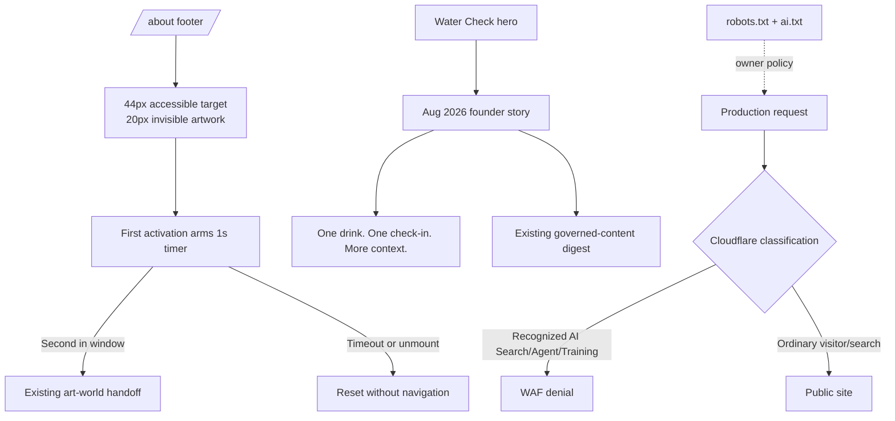

# Founder Story, Hidden Egg, and AI Crawler Controls - Plan

## Goal Capsule

- **Objective:** Add a truthful founder-story section to `/thewatercheck`, make the existing `/about` Easter egg genuinely hidden and require two deliberate activations, and replace the requested public inspect lock with honest, best-effort AI crawler controls.
- **Authority:** The Product Contract below governs behavior. The confirmed scope checkpoint governs the double-activation interaction, the inclusive founder-story tone, and the decision not to obstruct public browser tools.
- **Execution profile:** Extend the current React/Vite site and Cloudflare deployment policy without adding analytics, data collection, authentication, external scripts, or a new routing system.
- **Stop conditions:** Pause if the story would require an unsupported health claim, if the production domain is not proxied through an authenticated Cloudflare zone, or if applying crawler controls would unintentionally block ordinary search indexing.
- **Tail ownership:** Completion requires focused and full automated checks, owner approval of changed health-sensitive copy, browser verification on desktop and mobile, and production evidence that the configured Cloudflare controls behave as documented.

---

## Product Contract

### Summary

This change gives The Water Check a human origin story before its product walkthrough, turns the company footer egg into a genuinely invisible discovery that opens only after two quick presses, and strengthens the site's anti-AI preference through crawler directives and Cloudflare enforcement. Public right-click, selection, copy, and developer tools remain available because client-side blocking would inconvenience visitors without protecting public source.

### Problem Frame

The Water Check landing page explains the planned product but not why Denzel has carried the idea for six years. The missing personal context makes the page feel more like a feature pitch than a founder-led effort shaped by athletics, body judgment, and repeated conversations with women he cares about.

The existing golden egg is faintly visible and opens on one press. That makes the discovery accidental rather than secret. Its 25-pixel artwork can become 20 pixels while preserving the existing 44-pixel interaction target.

The site also contains theatrical context-menu and developer-tool triggers inside the hidden art experience. Extending those triggers to the public company or Water Check pages would not stop AI systems, scraping, source inspection, screenshots, or requests made outside a browser. The practical boundary is a clear crawler policy plus server-side enforcement for recognized automated traffic, with an explicit acknowledgment that no control can make public content inaccessible to every actor.

### Actors

- A1. **Water Check visitor:** An adult learning why the product is being built and what it may help them notice.
- A2. **Easter-egg finder:** A pointer, touch, or keyboard user who discovers the hidden target on the unified Mission, About, and Press destination.
- A3. **Expected End owner:** The person who approves health-sensitive founder copy and configures or authorizes production Cloudflare controls.
- A4. **Recognized AI crawler:** An automated client identified by a published crawler user agent or Cloudflare's AI bot categories.
- A5. **Ordinary visitor or search crawler:** A person or conventional search indexer that should retain normal access to the public site.

### Requirements

#### Hidden Easter egg

- R1. The existing golden-egg target remains present only on `/about`, the single destination containing the Mission, About, Founder Story, Press, and Contact sections.
- R2. The egg artwork is 20 by 20 pixels, exactly 20% smaller than its current 25-pixel artwork, while the interactive button remains at least 44 by 44 pixels.
- R3. The egg artwork has zero visual opacity at rest, hover, and pointer interaction. Keyboard focus may reveal a focus indicator around the otherwise invisible target so a focused control is not ambiguous.
- R4. The first pointer click, tap, Enter press, or Space press arms the target without entering the art world. A second activation through the same button within 1,000 milliseconds invokes the existing art-world handoff exactly once.
- R5. If the second activation does not occur within 1,000 milliseconds, the armed state resets. The timer is cleaned up on unmount, and a later activation starts a new two-press sequence.
- R6. The interaction retains a meaningful accessible name. The first activation gives assistive technology a concise “one more press” status without visually revealing the artwork or shifting layout.

#### Public browser behavior and AI crawler policy

- R7. The public Expected End and Water Check pages do not block `contextmenu`, text selection, copy, save, print, view-source, keyboard shortcuts, or developer tools. The existing theatrical scare triggers remain isolated to the entered hidden-art experience.
- R8. Ordinary public discovery remains enabled: the default `User-agent: *` policy continues to allow public pages and conventional search indexing while protecting existing artwork and audio paths.
- R9. Recognized AI search, agent, and training crawlers receive a site-wide disallow policy in `robots.txt`. The declaration includes the major crawler names supported by the current production-control inventory and is maintained as an explicit list rather than being described as universal protection.
- R10. `ai.txt` changes from its current open-company-text policy to a concise owner policy that does not authorize automated AI search, agent, training, fine-tuning, generation, or style-replication use. It identifies itself as a policy declaration, not an enforcement standard.
- R11. When `expectedend.co` is proxied through Cloudflare, A3 enables AI Crawl Control or the equivalent current dashboard control for Cloudflare's Search, Agent, and Training categories, confirms the resulting WAF rule precedes any allow rule that could bypass it, and enables AI Labyrinth if available and compatible with the zone.
- R12. The implementation and runbook state the limits plainly: `robots.txt` is voluntary, user agents can be spoofed, manual access remains possible, and public markup and assets cannot be made secret. No user-facing claim says the site is “AI-proof.”
- R13. Blocking AI search crawlers is an intentional discovery tradeoff. Ordinary search remains indexed, but ChatGPT, Claude, Perplexity, and similar AI answer engines may no longer cite, summarize, or refer users to the site.

#### Water Check founder story

- R14. A simple editorial founder-story section appears between the hero and the section beginning “One drink. One check-in. More context.”
- R15. The section contains a semantic `<time>` value for August 2026, the heading “What we’re building, and why,” and the byline “Denzel Rigaud, Founder of Expected End.”
- R16. The story speaks in Denzel's first-person voice, names women he grew up around without stereotyping women or presenting body concerns as universal, and frames the product as a calmer alternative to shame and blind restriction.
- R17. The story may describe Denzel's athletic experience with bloating and his six-year connection to The Water Check as personal motivation, not evidence that the planned product works.
- R18. The problem statement is: people often remember discomfort but lose the details around what they drank, ate, or did, leaving them to judge their bodies and guess at causes.
- R19. The solution statement is: the planned adult app creates a private record of drinks and later bloating check-ins, adds approximate hydration and nutrient context, and may help a user notice possible patterns or prepare better questions for a qualified professional.
- R20. The story does not say bloating proves someone is not fat, that a specific drink definitively caused a symptom, that everyone needs or should avoid a gallon of water, or that water flushing vitamins and minerals causes fatigue. It says hydration needs vary and bloating has many possible causes.
- R21. The story states that the planned app cannot diagnose a condition or prove causation. Persistent, severe, or concerning symptoms should be discussed with a qualified healthcare professional.
- R22. The section uses the existing Water Check type and light-blue visual language, adds no third-party asset or script, remains readable at 390 pixels, and introduces no horizontal overflow or motion dependency.
- R23. Because `src/water-check/water-check-page.tsx` is already a governed release source, changing the founder story invalidates the current governed-content digest and cannot ship publicly until A3 records renewed content-bound approval.

### Key Flows

- F1. **Discover the hidden art world**
  - **Trigger:** A2 focuses or locates the invisible footer target on `/about`.
  - **Steps:** The first activation arms the target and announces that one more press is needed. A second activation within one second invokes the existing handoff. A slow or isolated press expires without navigation.
  - **Outcome:** The art world opens only after a deliberate two-press discovery, with the same behavior for pointer, touch, Enter, and Space.
  - **Covered by:** R1-R6
- F2. **Read the founder story**
  - **Trigger:** A1 scrolls past the Water Check hero.
  - **Steps:** A1 encounters the date, heading, byline, personal motivation, problem, planned solution, and health limitation before the product journal walkthrough.
  - **Outcome:** A1 understands why the product is being built without receiving a diagnosis or guaranteed causal explanation.
  - **Covered by:** R14-R23
- F3. **Apply recognized crawler controls**
  - **Trigger:** A4 requests a public URL using a recognized AI crawler identity.
  - **Steps:** The repository policy disallows the crawler; Cloudflare categorization and its correctly ordered WAF control deny recognized automated traffic; monitoring records observed requests and violations.
  - **Outcome:** Known AI crawlers are discouraged and, where Cloudflare recognizes them, blocked at the edge without disabling normal browser functions.
  - **Covered by:** R7-R13
- F4. **Browse normally**
  - **Trigger:** A5 uses the site or an ordinary search crawler requests a public route.
  - **Steps:** The page loads, normal browser interactions remain available, and the default public indexing policy applies.
  - **Outcome:** Anti-AI controls do not turn into an accessibility, usability, or ordinary SEO regression.
  - **Covered by:** R7-R8, R12-R13

### Acceptance Examples

- AE1. **A single press does nothing destructive**
  - **Given:** A2 is on `/about` and has not armed the egg.
  - **When:** A2 activates the egg once.
  - **Then:** The art world does not open, no navigation occurs, and assistive technology receives “one more press.”
- AE2. **A timely second press opens once**
  - **Given:** The egg was activated less than 1,000 milliseconds ago.
  - **When:** A2 activates it again by click, tap, Enter, or Space.
  - **Then:** The existing art-world callback runs exactly once and the armed state resets.
- AE3. **A late press starts over**
  - **Given:** More than 1,000 milliseconds elapsed after the first activation.
  - **When:** A2 activates the egg again.
  - **Then:** That activation becomes the first press of a new sequence and does not open the art world.
- AE4. **Founder story has truthful adjacency**
  - **Given:** A1 reads the problem and planned-solution paragraphs.
  - **When:** The page describes possible drink and bloating patterns.
  - **Then:** The same section says the app cannot diagnose or prove cause and directs persistent or concerning symptoms to a qualified professional.
- AE5. **Recognized AI crawler is denied in production**
  - **Given:** Cloudflare controls are approved and enabled.
  - **When:** a production request presents a user agent represented in the policy and Cloudflare recognizes it as an AI crawler.
  - **Then:** the edge returns the configured denial response, while `robots.txt` independently contains the matching site-wide disallow.
- AE6. **Ordinary browsing remains intact**
  - **Given:** A5 loads a public page using a normal browser or ordinary search identity.
  - **When:** A5 right-clicks, selects text, uses browser shortcuts, or follows public links.
  - **Then:** the site does not intercept those actions, and the request is not denied by the AI-specific rule.

### Proposed Founder-Story Draft

> **Aug 2026**
>
> **What we’re building, and why**
>
> Denzel Rigaud, Founder of Expected End
>
> I grew up hearing women I care about look at themselves and say, “I’m fat.” I wanted to slow that judgment down: could it be bloating, and could we give the body some grace before deciding what it means? Bloating is not the answer every time, and lasting or concerning symptoms deserve a conversation with a qualified healthcare professional.
>
> I watched people skip meals or restrict themselves because they did not know why their body felt different that day. The feeling might follow food, a fizzy drink, an energy drink, a salty meal, training, or a change in routine. Bloating has many possible causes, and those everyday details are easy to forget once discomfort takes over.
>
> I know that frustration as an athlete. Feeling bloated before training or competition distracts me and changes how comfortable I feel in my body. Hydration advice can become another rigid rule. “Drink a gallon a day” sounds universal, but hydration needs vary with the person, their activity, the climate, and their life stage.
>
> The problem is that we remember the discomfort and lose the context. Then we guess, blame our bodies, or make a sudden change without a clear record of what happened.
>
> The Water Check is my attempt to replace that guess with a private record. The planned app will let adults log or scan a drink, review approximate hydration and nutrient context, and check in later about bloating. Over time, it may help someone notice possible patterns and prepare better questions for a doctor or dietitian. It will not diagnose a condition or prove that one drink caused a symptom.
>
> I have carried The Water Check with me for six years. Now I am building the version I wanted as an athlete and the version I wish the women I grew up around had: calm, private, and free from shame. You deserve information before you blame your body.

### Scope Boundaries

#### Included

- One revised Easter-egg interaction on the existing unified `/about` page.
- One founder-story editorial section and its responsive presentation on `/thewatercheck`.
- Repository-owned `robots.txt` and `ai.txt` policy updates.
- An operator runbook and authenticated Cloudflare AI crawler-control configuration for the production zone.
- Automated, browser, accessibility, content-approval, and production-edge verification.

#### Deferred to Follow-Up Work

- Performing the post-release quarterly reviews defined by the runbook as Cloudflare's crawler directory and published AI user agents evolve.
- Prerendering or server-rendering changes intended to improve conventional search and social previews.
- Final in-app health guidance, medical review, symptom triage, or clinical substantiation.

#### Outside This Milestone

- Hiding public source, preventing screenshots, encrypting public HTML, or promising universal scraper prevention.
- Blocking right-click, copy, selection, printing, view-source, or developer tools on public pages.
- Changing the hidden art-world scare experience beyond preserving its current post-entry behavior.
- Adding a newsletter, waitlist, analytics, fingerprinting, CAPTCHA, account, or visitor-data collection.
- Claiming that The Water Check determines why a person is bloated or produces a medical result.

---

## Planning Contract

### Key Technical Decisions

- KTD1. **Use explicit activation timing instead of a native double-click event.** A one-second armed state driven by the button's normal activation works for mouse, touch, Enter, and Space. Native `dblclick` is not a reliable cross-input contract and would leave keyboard behavior underspecified.
- KTD2. **Hide the artwork, not the accessible control.** Keep the 44-pixel button in layout and set the child image to zero opacity. Preserve a focus-visible outline and status announcement so invisibility does not erase keyboard semantics.
- KTD3. **Keep the scare system behind the existing art-world entry state.** `src/app/index.tsx` already passes `entered` into `useScareTriggers`. Public context-menu blocking is rejected because it neither secures public content nor respects normal browser behavior.
- KTD4. **Separate crawler preference from crawler enforcement.** `robots.txt` and `ai.txt` communicate owner intent; Cloudflare AI Crawl Control and WAF ordering provide the enforceable production layer for traffic Cloudflare recognizes. The runbook records both layers and their limits.
- KTD5. **Block AI categories while preserving conventional indexing.** Search, Agent, and Training AI categories are blocked intentionally. The ordinary `User-agent: *` allow policy and public `index, follow` metadata remain, so traditional SEO does not become collateral damage.
- KTD6. **Treat the founder story as governed health-sensitive copy.** The section belongs in the existing landing component, which is already included in the release digest. No duplicate approval mechanism is added; the existing content-bound release record must be renewed after the copy changes.
- KTD7. **Keep the story personal and claims conservative.** Denzel's experience supplies motivation, not efficacy proof. The copy uses “may” and “possible patterns,” names varied hydration needs and multiple possible causes of bloating, and places the diagnostic limitation in the same section.
- KTD8. **Do not turn crawler defense into visitor tracking.** No fingerprinting, challenge telemetry added by the app, custom bot database, or client-side detection is introduced. Cloudflare owns detection at the existing edge trust boundary.
- KTD9. **Use a dated crawler inventory instead of an unbounded “all AI” claim.** The implementation baseline covers GPTBot, OAI-SearchBot, ChatGPT-User, ClaudeBot, Claude-SearchBot, Claude-User, anthropic-ai, PerplexityBot, Perplexity-User, CCBot, Google-Extended, Applebot-Extended, Meta-ExternalAgent, FacebookBot, Amazonbot, Bytespider, cohere-ai, Diffbot, ImagesiftBot, and Omgilibot. The runbook records the inventory date and treats additions or renamed identities as maintenance, not retroactive proof that every crawler was blocked.

### High-Level Technical Design

### Implementation Constraints

- Preserve current uncommitted work and do not rewrite unrelated Water Check landing, legal, popup, community-link, or asset changes.
- Use the existing React, CSS Module, Vitest, Testing Library, Vite, and Cloudflare Pages patterns; add no package dependency.
- Use one stable 1,000-millisecond threshold for implementation and fake-timer tests.
- Keep the egg's button accessible even though its artwork is visually absent.
- Do not weaken the existing public-content release gate or populate pending owner approval fields without actual approval.
- Keep all founder-story presentation same-origin and text-only unless A3 separately supplies and clears an asset.
- Apply production Cloudflare settings only with authenticated owner authorization and record configuration evidence without secrets, tokens, account IDs, or personal data.

### System-Wide Impact

- **Application lifecycle:** The existing company-to-art-world callback remains the only transition. The egg gains local transient state and timer cleanup but no history, storage, or application-level state.
- **Accessibility:** Pointer, touch, Enter, and Space share the same button activation path. The invisible artwork retains an accessible name, focus indicator, minimum target size, and nonvisual first-press status.
- **Public browser behavior:** `useScareTriggers` remains disabled until the hidden art world has been entered. Public pages retain native context menu, selection, copy, and keyboard behavior.
- **Health-content governance:** The landing source is already part of `WATER_CHECK_GOVERNED_SOURCE_PATHS`; founder-copy changes automatically invalidate a stale digest. The release remains blocked until entity/contact/effective-date and content approval are resolved under the existing record.
- **Crawler and SEO boundary:** Repository directives deploy with the static public assets. Cloudflare adds edge enforcement for recognized AI traffic. The normal public allow group and `index, follow` metadata continue to serve conventional search.
- **Operations:** Cloudflare settings live outside Git. The runbook must record the date, responsible owner, enabled categories, WAF ordering evidence, test results, and rollback steps without recording credentials.
- **Failure behavior:** If Cloudflare is unavailable or does not recognize a crawler, the request may reach the public site. That is a documented limitation, not a reason to add deceptive client-side obstruction.

### Risks and Mitigations

| Risk | Consequence | Mitigation |
|---|---|---|
| An invisible control becomes inaccessible | Keyboard or assistive-technology users encounter an unexplained target | Retain a meaningful label, 44-pixel target, focus-visible outline, and polite first-press status; test keyboard behavior. |
| Timing makes activation frustrating | Users cannot intentionally open the art world or trigger it accidentally | Use one second, reset deterministically, and cover timely, late, rapid, and unmount cases with fake timers. |
| Founder copy implies diagnosis or guaranteed cause | Misleading health advertising and harm to visitors | Keep personal experience separate from product claims; state varied causes and needs; place a non-diagnostic limitation adjacent to the planned solution; require owner approval. |
| “For the ladies” becomes stereotyped copy | The story alienates the audience it intends to support | Refer specifically to women Denzel grew up around, focus on compassion and body judgment, and avoid claiming all women share the experience. |
| AI crawler policy creates false confidence | The owner believes public content is secret | Label directives and edge blocking best-effort; document spoofing, noncompliance, and manual access limits. |
| AI blocking removes useful referrals | AI answer engines stop citing or linking to Expected End | Treat this as the confirmed product tradeoff, record it in the runbook, and preserve ordinary search indexing. |
| Cloudflare WAF ordering allows bypass | A recognized AI request is allowed by an earlier rule | Inspect and record rule order; production verification must show denial for representative identities before completion. |
| Broad bot rules block people or ordinary search | Availability or SEO regression | Use Cloudflare's AI-specific categories, test a normal browser and conventional crawler, monitor after rollout, and document a one-setting rollback. |
| External dashboard state drifts from Git policy | Repository claims and production behavior diverge | Add a dated operations record and quarterly owner review; compare the repository inventory with Cloudflare's observed crawler directory and verify both static directives and edge responses during release. |

### Resolved During Planning

- The phrase “Mission · About · Press” refers to the single `/about` destination; only its existing footer egg changes.
- “20% smaller” applies to the 25-pixel artwork, producing a 20-pixel image. The 44-pixel target does not shrink.
- “Press twice” means two normal activations within 1,000 milliseconds, not a native desktop-only `dblclick` handler.
- The public site will not block inspect, context menus, copying, or browser shortcuts. The existing scare behavior remains confined to the entered art world.
- Recognized AI Search, Agent, and Training categories are all blocked, accepting the loss of AI answer-engine discovery while retaining ordinary search indexing.
- The founder story is written for an inclusive adult audience, with specific warmth toward women affected by body judgment and without stereotyping them.

### Deferred to Implementation

- Confirm the exact Cloudflare dashboard labels available to the production zone on the day of configuration; Cloudflare may rename controls without changing the intended Search, Agent, and Training policy.
- Record whether physical iOS/Safari testing is available. If not, document the environment limitation after responsive emulation rather than claiming physical-device coverage.

### Sources and Research

- `src/company-site/golden-egg-button.tsx`, `src/company-site/footer.tsx`, `src/company-site/index.tsx`, `src/company-site/about.test.tsx`, and `src/company-site/style.module.css` establish the current single `/about` egg, 44-pixel target, 25-pixel artwork, 1% opacity, and one-click callback.
- `src/app/index.tsx`, `src/app/index.test.tsx`, `src/scare/index.tsx`, and `src/scare/index.test.tsx` establish that context-menu and developer-tool scare triggers are already gated by the entered art-world state.
- `src/water-check/water-check-page.tsx`, `src/water-check/water-check-page.module.css`, and `src/water-check/water-check-page.test.tsx` establish the insertion point between the hero and “One drink. One check-in. More context.”
- `src/company-site/public-content.test.ts` and `src/water-check/legal/water-check-release-evidence.ts` establish that the Water Check landing source participates in the governed-content digest.
- `public/robots.txt`, `public/ai.txt`, and `index.html` establish the current selective AI policy and ordinary `index, follow` discovery posture.
- [Cloudflare AI Crawl Control overview](https://developers.cloudflare.com/ai-crawl-control/) supports monitoring and granular control of AI crawlers on proxied domains.
- [Cloudflare Manage AI crawlers](https://developers.cloudflare.com/ai-crawl-control/features/manage-ai-crawlers/) explains the WAF-backed block behavior and the distinction between user-agent detection on free plans and stronger Bot Management detection on paid plans.
- [Cloudflare AI Crawl Control with WAF](https://developers.cloudflare.com/ai-crawl-control/configuration/ai-crawl-control-with-waf/) supports the rule-ordering verification requirement.
- [Cloudflare managed robots.txt](https://developers.cloudflare.com/bots/additional-configurations/managed-robots-txt/) states that robots compliance is voluntary and recommends enforcement through AI Crawl Control.
- [Cloudflare AI Labyrinth](https://developers.cloudflare.com/bots/additional-configurations/ai-labyrinth/) supports the optional invisible no-follow honeypot layer for noncompliant AI crawlers.
- [OpenAI Publishers and Developers FAQ](https://help.openai.com/en/articles/12627856-publishers-and-developers-faq) distinguishes GPTBot training control from OAI-SearchBot discovery and documents the citation/referral tradeoff when search crawling is blocked.
- [FTC Health Products Compliance Guidance](https://www.ftc.gov/business-guidance/resources/health-products-compliance-guidance) requires truthful, substantiated express and implied health claims and warns that a disclaimer does not cure a contradictory claim.
- [CDC Water and Healthier Drinks](https://www.cdc.gov/healthy-weight-growth/water-healthy-drinks/index.html) supports saying water needs vary by personal and situational factors.
- [NIDDK Symptoms & Causes of Gas in the Digestive Tract](https://www.niddk.nih.gov/health-information/digestive-diseases/gas-digestive-tract/symptoms-causes) supports describing bloating as having many possible dietary and medical causes.
- [NIDDK Diagnosis of Gas in the Digestive Tract](https://www.niddk.nih.gov/health-information/digestive-diseases/gas-digestive-tract/diagnosis) supports a food-and-drink symptom diary as context a qualified professional may use, not as proof of causation.

---

## Owner-Supplied Release Inputs

- Renewed content-bound approval for the complete Water Check landing source after the founder-story draft is finalized, including approver identity, approval date, and matching governed-content digest.
- Confirmation that the first-person story accurately represents Denzel's experience and that “six years” is approved for public use.
- Authenticated access or explicit authorization to configure the `expectedend.co` Cloudflare zone.
- A dated owner record acknowledging the confirmed tradeoff that blocking Search, Agent, and Training categories may remove AI search/answer-engine citations and referrals.

---

## Implementation Units

### U1. Make the `/about` Easter egg invisible and double-activated

- **Goal:** Preserve the existing hidden-art handoff while requiring two deliberate activations through an invisible, accessible target.
- **Requirements:** R1-R7; F1; AE1-AE3, AE6; KTD1-KTD3
- **Dependencies:** None
- **Files:**
  - Modify `src/company-site/golden-egg-button.tsx`
  - Modify `src/company-site/style.module.css`
  - Modify `src/company-site/about.test.tsx`
  - Modify `src/app/index.test.tsx` only if an additional public-state regression assertion is needed beyond its existing `entered` coverage
- **Approach:**
  1. Add local armed state and a cleanup-safe one-second reset timer to the existing button rather than changing the application callback contract.
  2. Route every native button activation through the same handler. The first arms and announces; the second clears state and invokes `onActivate` once.
  3. Keep the button at 44 pixels, change the image dimensions to 20 pixels, and make the image remain zero-opacity during rest and hover. Preserve a visible keyboard focus indicator on the target and use `touch-action: manipulation` so the two-tap gesture is not treated as page zoom.
  4. Leave footer route selection and the application-level `entered` gate unchanged.
- **Test scenarios:**
  - Covers AE1. One click does not invoke the callback and exposes the nonvisual one-more-press status.
  - Covers AE2. Two clicks inside one second invoke the callback exactly once; the same is true for two Enter activations and two Space activations.
  - Covers AE3. Advancing fake timers beyond one second means the next activation only rearms the target.
  - Unmounting while armed leaves no pending timer effect or state update.
  - The image attributes are 20 by 20, the accessible target remains present only on `/about`, and the homepage remains egg-free.
  - The public application state still passes `false` to `useScareTriggers`; entering the art world still passes `true`.
- **Verification:** Focused tests prove the timing state machine and callback count; browser review confirms the artwork does not reveal on pointer hover and keyboard focus remains understandable.

### U2. Add the governed Water Check founder story

- **Goal:** Place the approved first-person story before the current product walkthrough with accurate problem, solution, and health boundaries.
- **Requirements:** R14-R23; F2; AE4; KTD6-KTD7
- **Dependencies:** None
- **Files:**
  - Modify `src/water-check/water-check-page.tsx`
  - Modify `src/water-check/water-check-page.module.css`
  - Modify `src/water-check/water-check-page.test.tsx`
  - Modify `src/water-check/legal/water-check-release-content.ts` only after A3 provides renewed approval and the recomputed digest
- **Approach:**
  1. Insert a distinct editorial section directly between the hero and existing story walkthrough.
  2. Render the date semantically, use a level-two heading, and keep the byline and paragraphs in a readable narrow text column.
  3. Use the Proposed Founder-Story Draft as the starting copy. Preserve its first-person voice, personal-athlete framing, explicit problem and solution, variable-hydration statement, and adjacent non-diagnostic limitation.
  4. Extend the existing light-blue palette and type system with restrained spacing and borders; add no animation or new imagery.
  5. Let the existing governed-source list detect the landing change. Record approval only after the final rendered copy is reviewed.
- **Test scenarios:**
  - Covers AE4. The date, heading, byline, problem, solution, “six years,” varied hydration needs, and non-diagnostic limitation render in the same section.
  - The founder section precedes the element containing “One drink. One check-in. More context.” in document order.
  - A claims regression assertion rejects definitive-cause language, the nutrient-flushing/fatigue claim, and a universal gallon recommendation.
  - The section contains no input, form, external asset, new script, or visitor-data collection.
  - At 390 pixels the text remains readable without horizontal overflow, and heading order remains coherent.
- **Verification:** Component tests and browser inspection show the story in the correct place and preserve the existing hero, store popup, Instagram community link, and journal walkthrough.

### U3. Align repository AI policy and document Cloudflare enforcement

- **Goal:** Replace the current open-AI-text policy with explicit site-wide crawler restrictions and an operationally honest enforcement runbook.
- **Requirements:** R7-R13; F3-F4; AE5-AE6; KTD3-KTD5, KTD8-KTD9
- **Dependencies:** None for repository files; authenticated Cloudflare access for production configuration
- **Files:**
  - Modify `public/robots.txt`
  - Modify `public/ai.txt`
  - Modify `src/company-site/public-content.test.ts`
  - Create `docs/operations/ai-crawler-controls.md`
  - Inspect `index.html` and preserve its ordinary `index, follow` policy unless verification finds a contradiction
- **Approach:**
  1. Preserve the default public allow group and existing artwork/audio exclusions.
  2. Maintain explicit site-wide disallow groups for the dated KTD9 baseline. Reconcile that list against Cloudflare's observed crawler directory during configuration and record any addition or renamed identity in the runbook instead of silently broadening the policy.
  3. Rewrite `ai.txt` as a dated owner policy that prohibits automated AI search, agent, training, fine-tuning, generation, and style replication while acknowledging that the file expresses preference rather than access control.
  4. Add static tests that preserve normal indexing, require representative AI groups to disallow `/`, prevent a return to the old “public text may be read” language, and keep crawler policy files free of secrets.
  5. Write a runbook for enabling Cloudflare Search, Agent, and Training blocks, checking WAF precedence, enabling AI Labyrinth where supported, capturing non-secret evidence, monitoring false positives, rolling back the edge rule, and reviewing the inventory quarterly.
- **Test scenarios:**
  - `robots.txt` contains `Allow: /` for the default public group and retains the sitemap and protected-media exclusions.
  - Representative GPTBot/OAI-SearchBot, ClaudeBot/Claude-SearchBot, PerplexityBot, CCBot, Google-Extended, Applebot-Extended, and Meta identities each resolve to `Disallow: /` in the static policy.
  - `ai.txt` no longer authorizes public company text for AI reading or citation and explicitly distinguishes policy from enforcement.
  - `index.html` retains conventional `index, follow`; no public script blocks context menus or browser shortcuts.
  - The runbook includes prerequisites, current categories, WAF-order check, AI Labyrinth decision, evidence fields, referral tradeoff, known limits, monitoring, and rollback.
- **Verification:** Static checks prove repository consistency; document review proves the runbook does not overclaim enforcement.

### U4. Apply and verify production controls and the combined experience

- **Goal:** Validate the three changes together and record truthful production evidence without weakening existing release gates.
- **Requirements:** R1-R23; F1-F4; AE1-AE6
- **Dependencies:** U1-U3, A3 approval and authenticated Cloudflare access for production-only gates
- **Files:**
  - Modify tests from U1-U3 only when verification exposes a concrete gap
  - Update `docs/operations/ai-crawler-controls.md` with dated, non-secret evidence after configuration
- **Approach:**
  1. Run focused tests, the complete suite, static checks, public-content checks, and the production build.
  2. Inspect `/about` and `/thewatercheck` at laptop and 390-pixel widths using pointer and keyboard input.
  3. Confirm the founder story's placement, typography, health limitation, and unchanged store popup/community behavior.
  4. Confirm public right-click, selection, copy, and browser shortcuts are not intercepted before art-world entry.
  5. With owner authorization, configure Cloudflare AI crawler categories, inspect WAF order, decide on AI Labyrinth, and record screenshots or exported non-secret configuration evidence outside the repository when it contains account metadata.
  6. Probe representative AI identities and ordinary browser/search identities against production, monitor for false positives, and record response outcomes and limitations in the runbook.
- **Test scenarios:**
  - Covers AE1-AE3 across click, keyboard, timeout, and route isolation.
  - Covers AE4 with the final rendered copy and renewed governed-content approval.
  - Covers AE5 with production edge responses for at least one representative identity from each enabled Cloudflare category and the explicit crawler list where safely testable.
  - Covers AE6 with a normal browser, conventional index policy, and unchanged public context-menu behavior.
  - Existing Water Check legal routes, store dialogs, Instagram community link, Expected End navigation, and hidden art experience retain their behavior.
  - No third-party script, new storage key, analytics call, form submission, console error, or horizontal overflow is introduced.
- **Verification:** Every applicable gate in the Verification Contract passes. If owner approval or authenticated Cloudflare evidence is unavailable, local implementation may be complete but public release remains explicitly blocked.

---

## Verification Contract

| Gate | Applies to | Done signal |
|---|---|---|
| Focused company interaction tests | U1 | About tests pass for single, double, timed-out, keyboard, route-isolation, and size behavior; app tests preserve the art-world trigger gate. |
| Focused Water Check tests | U2 | Founder-story content, order, limitations, and existing store/community interactions pass. |
| Static public-policy tests | U3 | Default public indexing, representative AI disallows, revised `ai.txt`, and unchanged public browser behavior pass. |
| Complete Vitest suite | U1-U4 | All existing and new tests pass without regression. |
| TypeScript and Biome checks | U1-U4 | Repository type and formatting/lint checks pass. |
| Production Vite build | U1-U4 | The production build contains the revised static policy and renders both changed routes without asset errors. |
| Water Check public-content release gate | U2, U4 | The final landing copy has named owner approval, approval date, approved legal facts, and a governed-content digest matching the current source. |
| Desktop and 390-pixel browser review | U1-U2, U4 | The egg remains visually absent except for its focus indicator, the founder story is correctly placed and readable, and no overflow or interaction regression appears. |
| Keyboard and assistive-state review | U1, U4 | Two Enter or Space activations work within the window; one press announces the next action; focus remains visible and callback counts are correct. |
| Public native-browser behavior | U1, U3-U4 | Context menu, selection, copy, print/save shortcuts, and developer tools are not intercepted before art-world entry. |
| Cloudflare configuration review | U3-U4 | Search, Agent, and Training categories are enabled as approved, WAF precedence is recorded, and AI Labyrinth status and rollback are documented. |
| Production crawler probes | U3-U4 | Representative recognized AI requests receive the configured denial while ordinary browser and conventional-search requests remain available; exact response evidence and detection limits are recorded. |
| Post-rollout monitoring | U4 | A3 checks AI Crawl Control/WAF events for false positives and policy violations after release and records whether rollback was needed. |

---

## Definition of Done

- `/about` contains one 44-pixel accessible Easter-egg target with 20-pixel artwork that remains visually zero-opacity during pointer use.
- One activation never enters the art world; a second activation within one second invokes the existing handoff exactly once for pointer, touch, Enter, and Space.
- Slow sequences reset, unmount cleanup is safe, focus remains visible, and the egg remains absent from other company routes.
- Public Expected End and Water Check pages preserve native context menu, selection, copy, save/print, view-source, keyboard shortcuts, and developer tools.
- The existing scare system remains active only after entry into the hidden art experience.
- `/thewatercheck` shows “Aug 2026,” “What we’re building, and why,” and “Denzel Rigaud, Founder of Expected End” between the hero and current story walkthrough.
- The final founder copy retains Denzel's personal motivation, explicitly states the problem and planned solution, treats women with warmth and specificity, and avoids stereotypes.
- The story says hydration needs vary, bloating has many possible causes, and the app cannot diagnose or prove causation; unsupported nutrient-flushing and universal-gallon claims are absent.
- The founder story is readable at 390 pixels and adds no new script, external asset, form, tracker, storage, or animation dependency.
- The changed landing content has renewed owner approval and a matching governed-content digest before public release.
- `robots.txt` preserves ordinary public indexing and blocks the documented recognized AI crawler inventory site-wide.
- `ai.txt` reflects the owner-approved closed AI-use policy without claiming that the file enforces access.
- Cloudflare Search, Agent, and Training controls are configured with verified WAF order, and AI Labyrinth is enabled or its omission is documented.
- The operations runbook records owner, date, configuration, referral tradeoff, known limits, non-secret verification evidence, monitoring, and rollback.
- Production probes show expected AI-specific denial and ordinary visitor/search availability, with limitations recorded instead of hidden.
- Focused tests, the full suite, static checks, public-content release gate, production build, responsive review, accessibility review, and production-edge verification pass.
- The final diff contains no public inspect lock, visitor tracking, duplicate egg, unrelated hidden-art rewrite, speculative health capability, secret, or unrelated cleanup.
