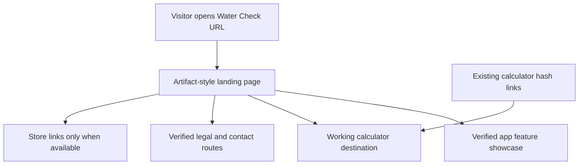

# The Water Check Claude landing page

## Goal Capsule

- **Objective:** Visitors to `expectedend.co/thewatercheckpage` see the Claude artifact's Water Check landing experience as the primary page, can reach a working hydration calculator, and encounter no placeholder or dead-end links.
- **Means:** Rebuild the artifact within the existing Expected End React site and retain the existing calculator as a working destination.
- **Authority:** The user's linked Claude artifact sets the visual direction; the live app and website repositories establish what features and legal content actually exist.
- **Stop conditions:** Do not publish claims about diagnosis, purchase availability, privacy, or app-review status that have not been verified. Do not publish placeholder contact details or legal links.

## Product Contract

The current website emphasizes its long calculator and recently added screenshot strip. The requested result is the Claude-designed page itself: its water-blue editorial hero, app mockup, why-water section, feature cards, calculator invitation, and grouped footer. The artifact is a visual reference, not a reliable implementation or copy authority.

### Requirements

- R1. Replace the current Water Check page composition with a responsive recreation of the linked artifact at the existing `/thewatercheckpage` URL.
- R2. Preserve the artifact's visual hierarchy, typography, blue gradient, floating navigation, device presentation, feature grid, cream calculator invitation, and footer layout on desktop and mobile.
- R3. Use real app screenshots or verified app UI for product imagery; do not imply a feature exists from a mockup alone.
- R4. The free-calculator call to action opens the existing working calculator. Existing inbound `/thewatercheckpage#calculator` links remain functional.
- R5. App Store and Google Play controls show accurate availability and become links only when live store URLs exist.
- R6. Navigation and footer links lead to real destinations. Keep website legal notices distinct from Water Check app notices; resolve or omit the artifact's placeholder app legal pages and support email before launch.
- R7. Remove the artifact's visible “Three ways to open” design-decision section from the published page. The final headline is a product copy decision.
- R8. Review health and body-image claims against the app's general-wellness boundary before publication. Preserve a clear educational disclaimer near the calculator.
- R9. Maintain the current site's metadata, canonical URL, sitemap entry, accessibility, reduced-motion support, and crawler checks.

### Open product decisions

- **Hero headline:** The owner chose “Drink up. We’ll keep count.” for the published hero.
- **App legal destinations:** The current Expected End `/privacy` and `/terms` govern the website, while the Water Check app has separate notices in its app repository. The artifact's EULA, AI Disclosure, DMCA, billing, sensitive-information, and security anchors have no matching public pages. Publish only verified destinations or create approved app-specific pages in a separate legal-content pass.
- **Support contact:** Use the existing Expected End contact route unless the owner supplies and approves a Water Check support address.

## Planning Contract

- KTD1. Build the page as local React/CSS and local image assets in `src/company-site/`; do not embed the Claude iframe or depend on temporary `claudeusercontent.com` URLs.
- KTD2. Keep the calculator's existing calculation behavior and safety text. Prefer a dedicated calculator route or an accessible reveal from the new page, with an adapter for the old `#calculator` hash; the final layout should not bury the artifact hero beneath the old long-form page.
- KTD3. Give the Water Check page its own navigation and footer within the current company-site router, so the design can match the artifact without changing other Expected End pages.
- KTD4. Treat the artifact's medical and business claims as draft copy. Compare them with current app behavior, the live store state, and approved legal notices before publishing.

### High-level flow

## Implementation Units

### U1. Lock copy and destinations

- **Goal:** Decide the headline, verify every feature statement, map each artifact link to a live destination, and remove placeholders.
- **Files:** `src/company-site/routes.ts`, `src/company-site/legal-content.ts`, `src/company-site/content.ts`, Water Check app legal and feature source files for verification.
- **Test scenarios:** Every published claim has a current product source; each visible link has a real target; unresolved legal links and support placeholders are absent; coming-soon store controls cannot be mistaken for live downloads.

### U2. Recreate the landing design

- **Goal:** Replace the current `/thewatercheckpage` composition with the artifact's layout, using local assets and responsive CSS.
- **Files:** `src/company-site/water-check-page.tsx`, `src/company-site/water-check-page.css`, `src/company-site/index.tsx`, `src/company-site/water-check-app.tsx`, `src/company-site/water-check-footer.tsx`, `public/media/water-check/`.
- **Test scenarios:** Desktop and iPhone widths preserve section order, readable typography, navigation, imagery, and working keyboard focus; reduced motion disables nonessential animation; every image loads from the production origin.

### U3. Keep the calculator working

- **Goal:** Provide a clear calculator destination from the artifact page and preserve old hash links while retaining the current math, input behavior, and safety guidance.
- **Files:** `src/company-site/water-check-page.tsx`, `src/company-site/routes.ts`, `src/company-site/water-check-inputs.test.tsx`, and a calculator component/route if extraction is needed.
- **Test scenarios:** Hero and cream-section calls to action open the working calculator; direct old hash URLs reach it; input editing changes the estimate; keyboard and mobile navigation return to the landing page.

### U4. Release and verify

- **Goal:** Ship the replacement through the site's normal release path and verify the production route.
- **Files:** `src/company-site/public-content.test.ts`, `public/sitemap.xml`, release notes if content or policy changes require them.
- **Test scenarios:** `npm run check`, focused Water Check tests, `npm run check:public-content`, and `npm run build` pass. Browser review covers desktop, iPhone, direct route refresh, calculator return, navigation, footer, and asset responses. Production verification checks the deployed bundle and each linked route; rollback is the prior website commit if needed.

## Verification Contract

| Check | Done signal |
|---|---|
| Product parity | Every app feature shown is present in the current Water Check build or explicitly labeled as preview/coming soon. |
| Page behavior | Navigation, calculator, footer, and direct-route refresh work on desktop and mobile. |
| Content | No placeholder email, dead anchor, unapproved medical promise, or misleading store availability remains. |
| Code gate | Site check, focused tests, public-content release gate, and production build pass. |
| Live gate | The production URL renders the intended page and local assets return successfully. |

## Definition of Done

The Claude artifact's page is recognizably reproduced at the existing Expected End Water Check URL, the real calculator remains usable, all visible links resolve correctly, claims and availability are accurate, and the deployed production page passes desktop/mobile and release checks.
